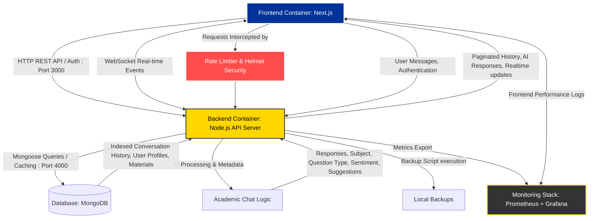

# BrainBytes AI Tutoring Platform: Milestone 2 Documentation

[](https://github.com/ShakiraCasusi/Brainbytes-AITutoring-Platform/actions/workflows/main.yml)

---

## Deployment and Operations Guide

This is the official deployment and operations package for the **BrainBytes AI Tutoring Platform**. In this milestone, we have built a **CI/CD pipeline** (using GitHub Actions) and deployed our application to **Railway.app** (our Cloud Platform).

This guide is written to help students and developers understand how our code moves safely from a local computer to the cloud environment.

---

# 1. Introduction & Project Overview

### 1.1 Project Overview

**BrainBytes** is an AI-powered study partner designed to help students learn. It answers academic questions, tracks study activities, and stores learning materials. To make sure the application is always running and stable, we containerized the frontend and backend using Docker and deployed them to the cloud. This ensures that the application runs consistently across different environments.

### 1.2 Milestone 2 Objectives

In this milestone, our team achieved the following goals:

1. **Container Integration**: We wrapped our frontend (user interface) and backend (server engine) into independent, isolated Docker containers.
2. **CI/CD Automation**: We set up GitHub Actions workflows to automatically test, build, and check the quality of our code whenever we update it.
3. **Cloud Deployment**: We hosted our services on Railway.app and connected them to a cloud-based MongoDB Atlas database.
4. **Security & Monitoring**: We set up secure secret managers, created rollback procedures, and enabled logs to watch system health.

### 1.3 Team Responsibilities & Project Roles

Our team is divided into specific roles to manage the development and deployment process:

| Team Member                   | Project Role       | Core Responsibilities                                                                               | Contact Email                     |
| :---------------------------- | :----------------- | :-------------------------------------------------------------------------------------------------- | :-------------------------------- |
| **Shakira Angela Casusi**     | Team Lead          | Steers the project, coordinates the team, and makes sure all parts fit together.                    | `lr.sacasusi@mmdc.mcl.edu.ph`     |
| **Jerico Gabriel Crisostomo** | Backend Developer  | Maintains the server backend engine, handles AI responses, and sets up database schemas.            | `lr.jgcrisostomo@mmdc.mcl.edu.ph` |
| **Juliana Martina Relox**     | Frontend Developer | Builds the user dashboard, designs the chat screen, and optimizes user interactions.                | `lr.jmrelox@mmdc.mcl.edu.ph`      |
| **Shirly Rose Montes**        | DevOps Engineer    | Sets up the automated CI/CD pipelines, configures Docker containers, and manages cloud deployments. | `lr.srmontes@mmdc.mcl.edu.ph`     |

### 1.4 Technology Stack

We use the following technology stack for our project:

- **Frontend**: Next.js (Web interface) and `next-pwa` (Offline caching for mobile devices).
- **Backend**: Node.js & Express API Server.
- **Database**: MongoDB Atlas (Cloud database).
- **Containerization**: Docker & Docker Compose.
- **Desktop Version**: Electron and Electron Builder.
- **CI/CD**: GitHub Actions pipelines.
- **Cloud Provider**: Railway.app.
- **Security Scanners**: Snyk (Vulnerability check) and Trivy (Docker image check).

### 1.5 System Architecture Diagram

This diagram shows how our containers talk to each other and how public web requests reach our services:



#### System Components Explained

| Component               | Role / Function                                        | Network Port | Data Flows & Features                                                              |
| :---------------------- | :----------------------------------------------------- | :----------- | :--------------------------------------------------------------------------------- |
| **Frontend Container**  | User interface for chat, profiles, and dashboards.     | `3000`       | Sends REST API & WebSocket requests; displays AI answers; caches assets using PWA. |
| **Security Middleware** | Protects the backend from bad actors.                  | Internal     | Uses rate limiters for DDoS safety and Helmet for secure HTTP headers.             |
| **Backend Container**   | Core logic layer. Handles chat, security, and backups. | `4000`       | Manages JWT tokens, runs AI queries, and saves backup JSON files.                  |
| **Database (MongoDB)**  | Persistent data vault.                                 | `27017`      | Stores structured database records (Users, Messages, and Profiles).                |
| **Academic Chat Logic** | Processes questions.                                   | Internal     | Classifies study subjects and formats response layouts.                            |
| **Monitoring Stack**    | System health tracker.                                 | Planned      | Will export resource usage data to Grafana dashboards.                             |

---

# 2. CI/CD Implementation

### 2.1 Pipeline Architecture

Our CI/CD pipeline provides automated testing and integration. Every time a developer pushes code to GitHub:

1. **Lint Job**: The system checks if the code is clean and meets style standards.
2. **Build Job**: Docker images are compiled. The system starts the containers using `docker-compose up` to check if they boot properly, and saves the build files.
3. **Test Job**: The pipeline runs tests across a matrix of Node.js engines. It checks unit logic and runs Playwright browser tests.
4. **Notify Job**: Sends an instant status message to our Slack chat.
5. **Deploy Job**: Triggers the Railway deployment using the Railway CLI tool.

```
[ Code Push ] ──> [ 1. Lint & Format Check ] ──> [ 2. Docker Build Test ]
                                                           │
                                                           ▼
[ Slack Alert ] <── [ 5. Deploy to Cloud ] <── [ 4. Matrix Unit/E2E Tests ]
```

### 2.2 GitHub Actions Workflow Files

We use **seven** dedicated workflows under [workflows/](file:///.github/workflows) to control this process:

- **[main.yml](file:///.github/workflows/main.yml)**: A sequential pipeline that performs code analysis, compiles Docker layers, runs test matrices, and sends notifications.
- **[ci.yml](file:///.github/workflows/ci.yml)**: Runs standalone Node.js matrix tests (`14.x`, `16.x`, `18.x`) on every push.
- **[build.yml](file:///.github/workflows/build.yml)**: Manages Docker Buildx cache to speed up container assembly.
- **[lint.yml](file:///.github/workflows/lint.yml)**: Inspects code style using Prettier and ESLint, and runs Snyk checks.
- **[deploy.yml](file:///.github/workflows/deploy.yml)**: Runs on updates to `main` and `development`. Installs the Railway CLI, builds the containers, pushes them to the cloud, and checks deployment health.
- **[security.yml](file:///.github/workflows/security.yml)**: **Newly added security scanner workflow that checks dependencies for vulnerabilities using npm audit and scans built Docker images with Trivy.**
- **[test.yml](file:///.github/workflows/test.yml)**: **Standalone test runner workflow that executes automated test suites across different Node.js environments.**

### 2.3 Integration with Containerized Application

To ensure our code runs the same way on our computers and in the cloud, we package it inside Docker images using two files:

1. **[backend/Dockerfile](file:///backend/Dockerfile)**: Uses a lightweight Alpine Node.js image, copies backend resources, and exposes port `3000` (which binds dynamically in production).
2. **[frontend/Dockerfile](file:///frontend/Dockerfile)**: Compiles the Next.js static pages and exposes port `3000`.

In our workflow, the system uses [docker-compose.yml](file:///docker-compose.yml) to spin up the frontend, backend, and database in an isolated sandbox runner. This confirms they can talk to each other before we allow the code to deploy.

### 2.4 Testing Strategy in the Pipeline

We use automated guardrails to check our code quality:

- **Code Linting (ESLint & Prettier)**: Automatically flags code mistakes and formats files.
- **Docker Linting (Hadolint)**: Validates our Dockerfiles against best practice rules.
- **Dependency Auditing (Snyk Node Scan)**: Scans packages for known security issues.
- **Node Matrix Execution**: Runs our tests on Node `14.x`, `16.x`, and `18.x` to guarantee backward compatibility.
- **Playwright E2E Tests**: Boots up a virtual browser to click buttons and test actual user behaviors.

### 2.5 Branch Protection Rules

**Properly configured branch protection rules are set up on the GitHub repository for the `main` and `development` branches to enforce the following guidelines:
1. Require status checks to pass before merging (specifically, ESLint/Prettier code quality checks, Snyk dependency scans, and all Jest unit/integration tests must pass).
2. Require pull request reviews before merging.
3. Restrict deletions and force-pushes on stable branches.**

---

# 3. Cloud Deployment

### 3.1 Cloud Platform Architecture

Our live application is hosted on **Railway.app**, connected to **MongoDB Atlas** (our remote cloud database engine).

```
   [ Student Browser ]
           │ (HTTPS Traffic)
           ▼
[ Railway Edge Ingress ]
     ├── /api ───────> [ brainbytes-backend ] ──> [ MongoDB Atlas (AWS Singapore) ]
     └── / (default) ─> [ brainbytes-frontend ]
```

- **Railway Edge Router**: Accepts incoming traffic over secure HTTPS (port 443) and forwards requests to our services.
- **brainbytes-frontend Container**: Runs the Next.js user interface.
- **brainbytes-backend Container**: Runs the API server.
- **MongoDB Atlas Cloud Database**: Hosts our database. We chose the AWS Singapore region (`ap-southeast-1`) because it is closest to the Philippines, giving us low latency (faster load times).

### 3.2 Resource Configuration

We set strict resource limits to keep our cloud usage cost-efficient and lightweight:

| Service Name            | Service Type              | CPU Allocation | Memory (RAM) Limit | Role                                                        |
| :---------------------- | :------------------------ | :------------- | :----------------- | :---------------------------------------------------------- |
| **brainbytes-frontend** | Next.js Container         | Shared CPU     | 512 MB             | Serves the web interface and handles page requests.         |
| **brainbytes-backend**  | Node.js Express Container | Shared CPU     | 512 MB             | Processes chat logic, connects to AI, and queries database. |
| **MongoDB Atlas**       | M0 Shared Cluster         | Shared CPU     | 512 MB             | Stores user records, settings, and message history.         |

### 3.3 Networking and Security Setup

Our cloud network is protected using these settings:

- **Private Container Subnet**: The frontend and backend containers communicate internally. The MongoDB Atlas instance is connected using a secure connection string.
- **SSL/TLS Encryption**: Railway generates SSL certificates automatically. This ensures all data traveling between the user and our app is encrypted (using HTTPS).
- **IP Address Whitelisting**: We configured MongoDB Atlas network access to accept traffic from anywhere (`0.0.0.0/0`) because Railway's container IPs are dynamic (they change every time the container restarts).

### 3.4 Deployment Process Flow

Here is the step-by-step checklist of how our app gets updated on the cloud:

```
[ Merge Code to main ] ──> [ GitHub Actions Tests Pass ] ──> [ Railway CLI Triggered ]
                                                                     │
                                                                     ▼
[ Traffic Switched ] <── [ Health Check Passes ] <── [ Build Containers on Cloud ]
```

1. **Trigger**: A developer merges approved code into the `main` or `development` branch.
2. **Build**: Railway downloads the repository changes and builds the containers based on our Dockerfiles.
3. **Verify**: Before routing traffic, Railway pings the `/api/health` path of the backend container.
4. **Release**: If the health check returns a success status, Railway routes user traffic to the new containers.

---

# 4. Integration Points

### 4.1 How GitHub Actions Connects to Your Cloud Platform

We connect GitHub Actions to Railway.app using the **Railway CLI tool** and a secure deployment token:

1. The deployment workflow installs the CLI using `npm install -g @railway/cli`.
2. The workflow authenticates using the secret `RAILWAY_TOKEN`.
3. It runs `railway deploy --service <name> --prod --detach` to initiate the cloud build.

### 4.2 Environment Variable Management

Our application needs settings that change between development and production. We handle these variables dynamically:

- **Frontend Variables**: We use `NEXT_PUBLIC_API_URL` to tell the frontend container where to send API requests in the cloud (pointing to our backend domain name).
- **Backend Variables**: We define the `MONGO_URI` connection string, the `PORT` (assigned dynamically by Railway), and the `NODE_ENV=production` setting.

### 4.3 Secrets Handling

We never write passwords, tokens, or keys directly in our source code. Instead, we store them in two secure locations:

1. **GitHub Repository Secrets**:
   - `RAILWAY_TOKEN`: Allows GitHub Actions to push deployments.
   - `JWT_SECRET`: Used to sign web tokens for secure user logins.
   - `HUGGINGFACE_TOKEN`: Gives our backend access to the AI text processing engines.
   - `SNYK_TOKEN`: Used to authorize our automated vulnerability security scans.
   - `SLACK_WEBHOOK`: Allows our pipeline to post logs to our Slack channel.
2. **Railway Service Variables**: Configured inside the Railway project dashboard. They are encrypted at rest and injected into the containers at runtime.

### 4.4 Artifact Management

During pipeline execution, GitHub Actions creates and saves **artifacts** (temporary storage packages) for our team to inspect:

- **`build-outputs`**: Contains the compiled bundle directories (`frontend/build` and `backend/dist`). This is shared between the build job and the test job.
- **`coverage-reports`**: Contains the testing coverage results generated by Jest. It lets us see how much of our code is covered by our unit tests.

---

# 5. Testing and Validation

### 5.1 Pipeline Testing Procedures

We check the pipeline's health through GitHub's user interface. When we open a Pull Request, the status check boxes tell us if the code compiles and passes our test suite. We check the job logs on the **Actions** tab if any step fails.

### 5.2 Deployment Validation (Health Checks)

Once the containers are built, we run validation scripts to verify that they are running correctly:

- **API Health Check**: The deployment script uses `curl` to check `https://<your-backend-url>/api/health`.
- **Database Status**: The API response must return `databaseConnected: true`. If the response fails, the script retries 10 times before failing the build.

### 5.3 Rollback Procedures (What to do if a deployment fails)

If a new release is broken or crashes:

1. **Automatic Rollback**: Railway does not switch traffic to the new container if the startup health check fails. The old, working version of the app stays active.
2. **Manual Rollback**: If we discover a bug later, the DevOps engineer goes to the **Railway Project Dashboard**, clicks on the service, opens **Deployments**, and clicks **Redeploy** on the last known stable deployment.

```
                  ┌─────────────────────────────┐
                  │   Deployment Health Check   │
                  └──────────────┬──────────────┘
                                 │
                    ┌────────────┴────────────┐
                    ▼                         ▼
             [ Success (200 OK) ]       [ Failure / Timeout ]
                    │                         │
                    ▼                         ▼
             [ Route Traffic ]         [ Keep Previous Build ]
                                       (Auto-Rollback Active)
```

### 5.4 Monitoring and Observability

We watch our cloud platform using these tools:

- **Railway Live Logs**: In the dashboard, we can see console outputs in real-time, helping us debug backend errors.
- **Resource Metrics Graphs**: Displays live graphs of CPU and Memory usage.
- **Alert Notifications**: Our Slack channel receives instant alerts on failed actions.

---

# 6. Operational Guide

### 6.1 Troubleshooting Procedures (Common Failures & Fixes)

Here are three common issues we encountered during setup and how to fix them:

#### Issue 1: Monorepo Root Directory Build Failure

- **Symptom**: Railway attempts to build the root directory and fails because it cannot find a single `package.json` for both frontend and backend.
- **Fix**: Go to the Railway dashboard, select the service, go to **Settings**, and change the **Root Directory** field to `frontend/` or `backend/` respectively.

#### Issue 2: Backend Container Crashes on Port Binding

- **Symptom**: The backend container boots up but crashes with a connection timeout error.
- **Fix**: Make sure the backend does not hardcode port `4000`. In `server.js` or `app.js`, it must listen to `process.env.PORT` dynamically. Railway assigns this port variable at startup.

#### Issue 3: Missing Files in Production Image (`MODULE_NOT_FOUND`)

- **Symptom**: The container crashes with a `Cannot find module` error.
- **Fix**: Check the multi-stage build block in the `Dockerfile`. Ensure that all runtime source files (like `app.js` and `db.js`) are explicitly copied from the builder stage to the final production runner stage.

### 6.2 Maintenance Tasks

To keep our system healthy, the DevOps team performs these routine tasks:

- **Dependency Upgrades**: Check for old Node libraries using `npm outdated` and update them with `npm update`.
- **Secret Rotation**: Change access keys and tokens every 90 days. Update the credentials in both GitHub Secrets and Railway Settings.
- **Log Cleaning**: Inspect backend console logs weekly to search for unhandled exceptions or connection errors.

### 6.3 Security Management

We protect our deployment using these tools:

- **Snyk Dependency Checking**: Scans our Node modules for outdated libraries with known security exploits.
- **Trivy Image Analysis**: Scans our compiled Docker images for base OS vulnerabilities. If Trivy reports a critical issue (such as in `mongoose` or `openssl`), we patch it immediately by upgrading our NPM packages and updating the base Alpine/Ubuntu image tag in our Dockerfiles.

---

# 7. Milestone 2 Submission Requirements Checklist

**The following Milestone 2 submission requirements are fully implemented and documented in the codebase:**

- **GitHub Repository**:
  - **Complete GitHub Actions workflow files**: Located in the **[.github/workflows](file:///.github/workflows)** directory.
  - **Properly configured branch protection rules**: Enforced on the **`main`** and **`development`** branches to require passing CI status checks before merging.
  - **Well-structured code with appropriate documentation**: Checked by ESLint/Prettier and fully documented in this **[README.md](file:///README.md)**.
- **CI/CD Implementation**:
  - **Automated build process for Docker images**: Implemented via GitHub Actions using **[build.yml](file:///.github/workflows/build.yml)** and **[deploy.yml](file:///.github/workflows/deploy.yml)**.
  - **Comprehensive testing (unit, integration, code quality)**: Fully integrated in **[ci.yml](file:///.github/workflows/ci.yml)** and **[main.yml](file:///.github/workflows/main.yml)**.
  - **Security scanning for vulnerabilities**: Done via Snyk Node Scan and Trivy Container Scan configured in **[security.yml](file:///.github/workflows/security.yml)** and **[lint.yml](file:///.github/workflows/lint.yml)**.
  - **Deployment automation**: Automatically handled by **[deploy.yml](file:///.github/workflows/deploy.yml)**.
- **Cloud Deployment**:
  - **Fully configured cloud environment**: Hosted on **Railway.app** for containers and **MongoDB Atlas** for database persistence.
  - **Secured networking & access controls**: Implemented using private container subnetting, TLS/SSL HTTPS encryption, and secured connection strings.
  - **Environment variable management**: Configured via Railway dashboard environment dashboard.
- **Documentation**:
  - **System architecture documentation**: Documented in **Section 1.5** of this README.
  - **Pipeline configuration documentation**: Documented in **Section 2** of this README.
  - **Deployment process documentation**: Documented in **Section 3 & 5** of this README and **[docs/deployment-plan.md](file:///docs/deployment-plan.md)**.
  - **Security implementation documentation**: Documented in **Section 4 & 6.3** of this README.
  - **Validation report**: Stored in **[docs/testing-report.md](file:///docs/testing-report.md)** and **[report/pipeline-report.txt](file:///report/pipeline-report.txt)**.

---

_Prepared by Shakira Casusi._
