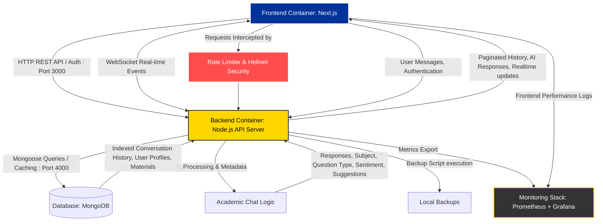

# BrainBytes AI Tutoring Platform

## Project Overview

BrainBytes is an AI-powered tutoring platform designed to provide accessible academic assistance to Filipino students. This project implements the platform using modern DevOps practices and containerization.

## Development Team

- [Shakira Angela Casusi] - Team Lead - [lr.sacasusi@mmdc.mcl.edu.ph]
- [Jerico Gabriel Crisostomo] - Backend Developer - [lr.jgcrisostomo@mmdc.mcl.edu.ph]
- [Juliana Martina Relox] - Frontend Developer - [lr.jmrelox@mmdc.mcl.edu.ph]
- [Shirly Rose Montes] - DevOps Engineer - [lr.srmontes@mmdc.mcl.edu.ph]

## Project Goals

- Implement a containerized application with proper networking
- Create an automated CI/CD pipeline using GitHub Actions
- Deploy the application to Oracle Cloud Free Tier
- Set up monitoring and observability tools

## Technology Stack

- Frontend: Next.js
- Backend: Node.js
- Database: MongoDB
- Containerization: Docker
- PWA: next-pwa
- Desktop: Electron and Electron Builder
- CI/CD: GitHub Actions
- Cloud Provider: Oracle Cloud Free Tier
- Monitoring: Prometheus & Grafana

## Project Architecture Diagram - Updated

### Project Architecture Diagram - Components Explained

| **Component**                       | **Role / Function**                                                       | **Port / Mechanism** | **Data Flows & Features**                                                                                                                               |
| ----------------------------------- | ------------------------------------------------------------------------- | -------------------- | ------------------------------------------------------------------------------------------------------------------------------------------------------- |
| **Frontend Container (Next.js)**    | User interface for chat, profiles, and dashboards.                        | `3000`               | - Sends REST API & WebSocket requests to Backend - Receives AI responses, paginated history, and realtime events - PWA caching via Service Worker |
| **Security & Middleware**           | Protects the backend from excessive load and vulnerabilities.             | Internal             | - Uses `express-rate-limit` for DDoS protection - Uses `helmet` for secure HTTP headers                                                              |
| **Backend Container (Node.js API)** | Core logic; handles auth, WebSockets, rate limiting, and chat processing. | `4000`               | - Handles JWT Authentication - Generates JSON Backups (`scripts/backup.js`) - Manages user settings & learning materials                          |
| **Database (MongoDB)**              | Stores all persistent structured data using Mongoose schemas.             | `27017`              | - Validates data upon entry - Uses optimized indexes for fast lookups - Stores Users, Profiles, Messages, and Materials                           |
| **Academic Chat Logic**             | Processes user input to generate relevant AI answers.                     | Internal             | - Analyzes user sentiment & categorizes subjects - Provides actionable suggestions & math handling                                                   |
| **Monitoring Stack**                | Future-ready stack for tracking application health.                       | Planned              | - Will collect metrics for observability                                                                                                                |

---

# BrainBytes CI/CD Documentation

This section details the custom Continuous Integration and Continuous Deployment (CI/CD) pipelines configured for the BrainBytes AI tutoring platform.

## Codebase Workflows

### 1. Main Sequential Workflow (`main.yml`)

**Purpose**: Comprehensive sequential pipeline running code analysis, image compilation, and multi-version test matrices on pushes and pull requests to `main` and `development`.

**Jobs & Stages**:

1. **`lint` (Lint Code)**:
   - Restores npm dependencies from GitHub's cache.
   - Generates ESLint outputs inside `eslint-report.json` and posts inline visual annotations inside pull requests via `eslint-annotate-action@v2`.
   - Checks code styling conformity via Prettier.
   - Audits dependencies via `npm audit --json` and executes automated vulnerability scanning via **Snyk Node scan** using your `SNYK_TOKEN`.
2. **`build` (Build Docker Images)**:
   - _Depends on successful `lint` (`needs: lint`)_.
   - Sets up Buildx and restores Docker layer caches from `/tmp/.buildx-cache`.
   - Compiles both `brainbytes/frontend:latest` and `brainbytes/backend:latest` images.
   - Tests container lifecycles by starting (`docker-compose up -d`), verifying (`docker-compose ps`), and stopping (`docker-compose down`) the multi-container stack.
   - Archives compiled bundles (`frontend/build` and `backend/dist`) into a GHA shareable artifact named `build-outputs`.
3. **`test` (Run Tests)**:
   - _Depends on successful `build` (`needs: build`)_.
   - Executes tests in parallel across a matrix of **Node.js versions (`14.x`, `16.x`, `18.x`)** and `ubuntu-latest` OS.
   - Downloads the archived compiled `build-outputs` artifact.
   - Installs dependencies and runs unit tests (`npm test`) for frontend and backend.
   - Executes `npm run test:coverage` and uploads reports under `coverage-reports`.
   - Downloads Playwright browser engines and runs browser-based E2E tests in the `tests/` directory.
4. **`notify` (Pipeline Status Notifications)**:
   - _Runs regardless of overall success or failure (`if: always()`)_.
   - Dispatches visual color-coded reports to your Slack channel via `action-slack-notify@v2` using your `SLACK_WEBHOOK` secret.

### 2. Standalone CI Testing Workflow (`ci.yml`)

**Purpose**: Runs independent, matrix-based unit, integration, and coverage tests across Node.js versions `14.x`, `16.x`, and `18.x` on every push and pull request, archiving Jest/Node HTML coverage reports.

### 3. Standalone Docker Build Workflow (`build.yml`)

**Purpose**: Standalone image building pipeline which manages Buildx v3 caches and validates Docker Compose up/down lifecycles on code pushes.

### 4. Standalone Code Quality Linting (`lint.yml`)

**Purpose**: Dedicated, non-blocking pipeline checking coding styles and Snyk security parameters on pushes and PRs.

### 5. Independent Deployment Workflow (`deploy.yml`)

**Purpose**: Dedicated test environment release pipeline triggering on pushes to `main` or `development` branches to compile Docker containers, set release metadata (`DEPLOY_TIME`, `DEPLOY_SHA`), and verify health endpoints.

## Pipeline Optimization & Caching

Our workflows are optimized using caching structures:

- **Node package cache**: Caches `**/node_modules` indexed against `**/package-lock.json` to prevent downloading dependencies from scratch on every run.
- **Docker layer cache**: Caches build layers in `/tmp/.buildx-cache` indexed against the commit SHA.

---

## Required Manual Repository Settings

To activate these workflows and satisfy security guidelines, you **must manually configure** the following options in your GitHub repository settings:

### 1. Configure Branch Protection & Required Status Checks

Prevent direct commits to the production branch and ensure quality checks pass before code can be merged:

1. Go to your GitHub repository and click on **Settings** in the top navigation bar.
2. In the left-hand sidebar, click on **Branches**.
3. Under _Branch protection rules_, click on **Add rule**.
4. Set **Branch name pattern** to `main`.
5. Check the box **"Require a pull request before merging"** and check **"Require approvals"** (set to at least `1`).
6. Check the box **"Require status checks to pass before merging"**.
7. In the search box under _Status checks_, search for and select the specific job identifiers from `main.yml`:
   - **`Lint Code`** (checks eslint, snyk, prettier)
   - **`Run Tests`** (checks test suite matrices across node versions)
   - **`Build Docker Images`** (checks docker compose start/stop validations)
8. Click **Create** at the bottom to lock the protection rule.

### 2. Add Repository Secrets for Sensitive Variables

Workflow jobs require external tokens to publish reports, send Slack messages, and scan folders securely. Add these variables to your repository:

1. Go to your GitHub repository and click on **Settings**.
2. In the left-hand sidebar, click on **Secrets and variables** > **Actions**.
3. Click on the green **New repository secret** button.
4. Add the following secrets:
   - **`SNYK_TOKEN`**: Your Snyk platform API authorization token. Enable Snyk automated dependency vulnerability checking.
   - **`SLACK_WEBHOOK`**: The incoming webhook URL for your designated Slack channel. Triggers visual pipeline status alerts.
   - **`DOCKERHUB_USERNAME`** and **`DOCKERHUB_TOKEN`** _(Optional)_: Set these if you wish to push compiled images to a Docker registry in subsequent weeks.
5. Click **Add secret** to save.

### 3. Create GitHub Issue Templates

We have pre-configured GitHub issue templates inside your codebase under `.github/ISSUE_TEMPLATE/`:

- **Bug Report Template** (`bug_report.md`): Automatically prompts users to enter reproduction steps, environment details, and expected behavior.
- **Feature Request Template** (`feature_request.md`): Structured to outline proposed enhancements and use cases.
  These will automatically display under the "Issues" tab when creating new tickets on GitHub!

---

## Troubleshooting Common Issues

### 1. Workflow Failures

- **Symptom**: Jobs inside `main.yml` or `lint.yml` crash or show error statuses.
- **Troubleshooting**:
  - Open the **Actions** tab, click on the failed workflow run, and click on the failed job (e.g. _Lint Code_) to inspect logs.
  - If Snyk scanning fails due to authorization, ensure the `SNYK_TOKEN` has been correctly entered in Settings.
  - Verify that the local test suites run and pass successfully in your development console (`npm test`) before pushing new commits.

### 2. Slack Notification Failures

- **Symptom**: The pipeline completes successfully, but no status alert is sent to your channel.
- **Troubleshooting**:
  - Verify that your webhook URL has been added as the `SLACK_WEBHOOK` secret inside repository settings.
  - Check that the webhook integration has not been deleted or deactivated inside your Slack app dashboard.

### 3. Deployment Issues

- **Symptom**: The `deploy.yml` workflow run reports "Service not available yet" or crashes.
- **Troubleshooting**:
  - Verify that ports in `docker-compose.yml` (`8080:3000`, `4000:3000`) are open and do not clash with other running applications on the host runner.
  - Inspect running container health statuses using standard logging commands (`docker-compose logs`).
