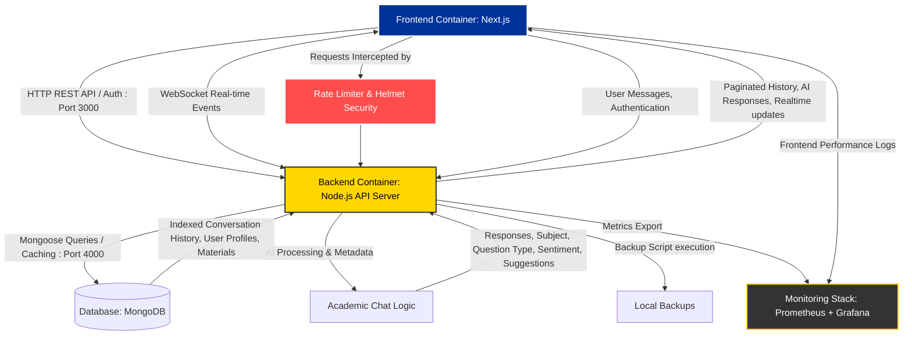

# BrainBytes AI Tutoring Platform

## Project Overview

BrainBytes is an AI-powered tutoring platform designed to provide accessible academic assistance to Filipino students. This project implements the platform using modern DevOps practices and containerization.

## Development Team

- [Shakira Angela Casusi] - Team Lead - [lr.sacasusi@mmdc.mcl.edu.ph]
- [Jerico Gabriel Crisostomo] - Backend Developer - [lr.jgcrisostomo@mmdc.mcl.edu.ph]
- [Juliana Martina Relox] - Frontend Developer - [lr.jmrelox@mmdc.mcl.edu.ph]
- [Shirly Rose Montes] - DevOps Engineer - [lr.srmontes@mmdc.mcl.edu.ph]

## Project Goals

- Implement a containerized application with proper networking
- Create an automated CI/CD pipeline using GitHub Actions
- Deploy the application to Oracle Cloud Free Tier
- Set up monitoring and observability tools

## Technology Stack

- Frontend: Next.js
- Backend: Node.js
- Database: MongoDB
- Containerization: Docker
- PWA: next-pwa
- Desktop: Electron and Electron Builder
- CI/CD: GitHub Actions
- Cloud Provider: Oracle Cloud Free Tier
- Monitoring: Prometheus & Grafana

## Project Architecture Diagram - Updated

### Project Architecture Diagram - Components Explained

| **Component**                       | **Role / Function**                                                       | **Port / Mechanism** | **Data Flows & Features**                                                                                                                               |
| ----------------------------------- | ------------------------------------------------------------------------- | -------------------- | ------------------------------------------------------------------------------------------------------------------------------------------------------- |
| **Frontend Container (Next.js)**    | User interface for chat, profiles, and dashboards.                        | `3000`               | - Sends REST API & WebSocket requests to Backend - Receives AI responses, paginated history, and realtime events - PWA caching via Service Worker |
| **Security & Middleware**           | Protects the backend from excessive load and vulnerabilities.             | Internal             | - Uses `express-rate-limit` for DDoS protection - Uses `helmet` for secure HTTP headers                                                              |
| **Backend Container (Node.js API)** | Core logic; handles auth, WebSockets, rate limiting, and chat processing. | `4000`               | - Handles JWT Authentication - Generates JSON Backups (`scripts/backup.js`) - Manages user settings & learning materials                          |
| **Database (MongoDB)**              | Stores all persistent structured data using Mongoose schemas.             | `27017`              | - Validates data upon entry - Uses optimized indexes for fast lookups - Stores Users, Profiles, Messages, and Materials                           |
| **Academic Chat Logic**             | Processes user input to generate relevant AI answers.                     | Internal             | - Analyzes user sentiment & categorizes subjects - Provides actionable suggestions & math handling                                                   |
| **Monitoring Stack**                | Future-ready stack for tracking application health.                       | Planned              | - Will collect metrics for observability                                                                                                                |
