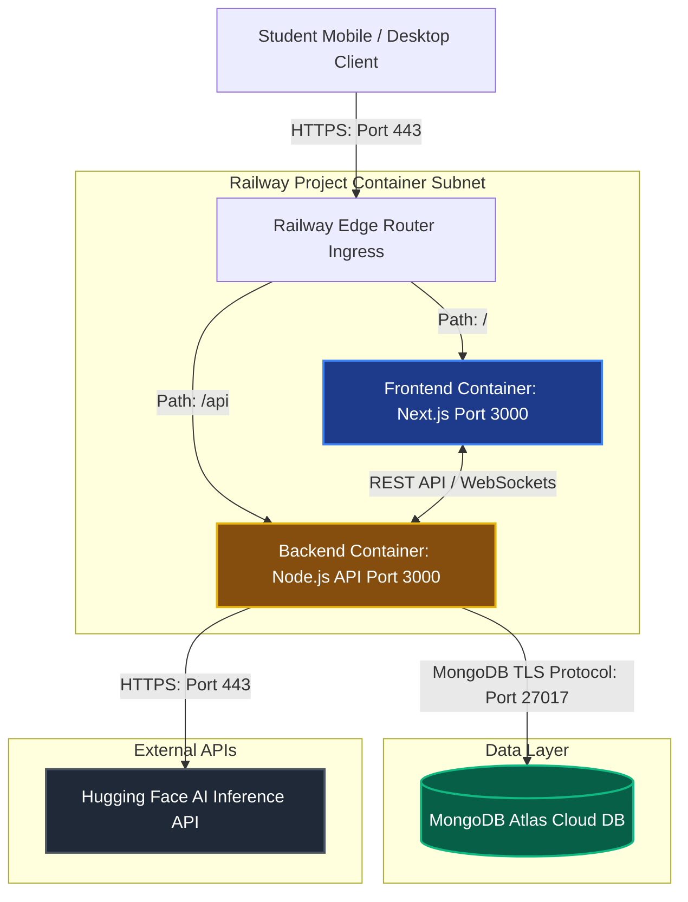
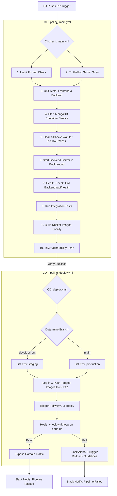

# BrainBytes AI Tutoring Platform: DevOps & Operations Manual

[](https://github.com/ShakiraCasusi/Brainbytes-AITutoring-Platform/actions/workflows/main.yml)

---

## 1. Introduction & Project Overview

### 1.1 Project Overview & End-User Context
**BrainBytes** is an AI-powered study partner designed specifically to meet the needs of Filipino students. In the Philippines, students navigate unique operational hurdles:
- **Unstable Cellular Connectivity:** High latency and frequent network dropouts (varying between 3G, 4G, and intermittent 5G) are common, especially in rural and provincial areas. To mitigate this, BrainBytes implements offline caching strategies via a Progressive Web App (PWA) configured with `next-pwa` so core study assets load instantaneously.
- **Hardware Constraints:** Many students rely on low-end or older-generation mobile devices. The architecture prioritizes server-side processing to minimize client-side hydration CPU cycles.
- **Traffic Seasonality:** During exam weeks (midterms and finals), student concurrent loads spike exponentially. The infrastructure requires robust autoscaling and database performance optimizations to prevent service degradation.
- **Compliance (Data Privacy Act of 2012):** In compliance with the Philippine National Privacy Commission (NPC), student PII (Personally Identifiable Information), including profiles and conversation logs, is encrypted at rest in MongoDB Atlas and in transit using SSL/TLS, preventing unauthorized access.

### 1.2 Milestone 2 Objectives
- **Container Integration:** Containerized the Next.js frontend, Node.js Express backend, and isolated local database environments.
- **Pipeline Consolidation:** Cleaned up redundant files and consolidated checks into a single multi-stage verification flow.
- **Production-Ready Build/Push:** Implemented automated image tagging (`sha-<git-sha>`, branch name, and `latest`) and pushed to GitHub Container Registry (GHCR).
- **Security Gates:** Embedded automated TruffleHog secret scanning and Trivy image scanning in the CI pipeline.
- **Reliable Testing:** Integrated health-check wait loops instead of static sleeps to ensure fast, deterministic tests.

### 1.3 Team Responsibilities & Project Roles
| Team Member                   | Project Role       | Core Responsibilities                                                                               | Contact Email                     |
| :---------------------------- | :----------------- | :-------------------------------------------------------------------------------------------------- | :-------------------------------- |
| **Shakira Angela Casusi**     | Team Lead          | Coordinates integration milestones, code reviews, and architectural changes.                       | `lr.sacasusi@mmdc.mcl.edu.ph`     |
| **Jerico Gabriel Crisostomo** | Backend Developer  | Manages AI prompt routing, Express endpoints, and Mongoose database schemas.                       | `lr.jgcrisostomo@mmdc.mcl.edu.ph` |
| **Juliana Martina Relox**     | Frontend Developer | Designs user dashboards, chat interface logic, and handles service-worker PWA assets.               | `lr.jmrelox@mmdc.mcl.edu.ph`      |
| **Shirly Rose Montes**        | DevOps Engineer    | Maintains CI/CD pipelines, Docker configurations, cloud deployments, and registry pushes.            | `lr.srmontes@mmdc.mcl.edu.ph`     |

### 1.4 Technology Stack
- **Frontend:** Next.js (Static Export / Hydrated Client) & `next-pwa` for offline asset distribution.
- **Backend:** Node.js, Express, rate-limiting, and Helmet headers.
- **Database:** MongoDB Atlas (AWS Singapore region `ap-southeast-1` to minimize latency to the Philippines).
- **Containerization:** Docker & Docker Compose.
- **CI/CD Platform:** GitHub Actions.
- **Registry:** GitHub Container Registry (`ghcr.io`).
- **Cloud Provider:** Railway.app (Staging & Production environments).

### 1.5 System Architecture Diagram
The diagram below illustrates how container services interact, terminate SSL, and connect to cloud assets.



---

## 2. CI/CD Implementation

### 2.1 Pipeline Architecture & Master Flow
Our pipeline consists of a CI gate (`main.yml`) and a CD deployment runner (`deploy.yml`). Pushing to `main` or `development` branches triggers the flow:



### 2.2 GitHub Actions Workflows
We consolidated redundant workflows into **two** main files:
1. **[main.yml](file:///.github/workflows/main.yml) (CI Master Pipeline):** Executed on all pushes and PRs. It runs ESLint, Prettier, TruffleHog secret scanning, unit tests (utilizing mock mongoose models to avoid DB startup delays), spins up a local MongoDB container, uses curl retry loops to verify backend initialization, and builds microservice images to scan them with Trivy.
2. **[deploy.yml](file:///.github/workflows/deploy.yml) (Multi-Environment CD Pipeline):** Executed on pushes to `main` and `development`. It compiles, tags (`sha-<commit-sha>`, branch name, and `latest` for prod), and pushes production-ready images to GitHub Container Registry (GHCR), deploys to Railway Staging vs. Production, polls the public health checks, and alerts or rolls back if necessary.

---

## 3. Cloud Deployment

### 3.1 Network Topology & Multi-Environment Setup
We maintain two isolated clusters on Railway:
- **Staging Environment:** Dedicated to testing features before release. It operates on its own backend domain (e.g., `brainbytes-backend-staging.up.railway.app`) and connects to a separate staging database.
- **Production Environment:** Hosts live student traffic on production domains (e.g., `brainbytes-backend.up.railway.app`).

To restrict database access securely:
> [!IMPORTANT]
> - **MongoDB Atlas IP Restriction:** Since Railway containers run on dynamic IP addresses, we use secure proxies (like *Fixie* or *QuotaGuard*) to route database traffic through static exit IPs. MongoDB Atlas is configured to whitelist *only* these static proxy IPs rather than the insecure `0.0.0.0/0` (anywhere).

### 3.2 Autoscaling Policies
For exam-period traffic spikes, Railway services are configured with dynamic autoscaling policies:
- **Scale-Out Trigger:** Scale replicas from 1 to 5 if CPU usage exceeds **70%** or Memory utilization exceeds **80%** for more than 2 minutes.
- **Scale-In Trigger:** Slowly scale down to 1 replica if CPU usage remains below **30%** for more than 10 minutes to minimize cloud billing.

---

## 4. Operational Guide

### 4.1 Zero-Downtime Deployment
To ensure zero service interruptions during deployments, we use **Rolling Updates**:
1. When a new deployment is triggered, Railway boots up the new container replicas in parallel with the active containers.
2. Traffic is *not* sent to the new container until its internal health check (`/api/health`) responds with a `200 OK` status and `databaseConnected: true`.
3. Once verified healthy, traffic is routed to the new containers, and the old container replicas are gracefully drained of connections and stopped.

### 4.2 Automated & Manual Rollback Guidelines
- **Automatic Rollback:** If a deployment fails to start or fails its internal health check probes during boot, Railway marks the deployment as unhealthy and never promotes it. Traffic continues routing to the last working deployment.
- **Manual Rollback:** If a bug escapes to production, run the following CLI command from the repository:
  ```bash
  railway rollback
  ```
  Alternatively, open the Railway project console, click **Deployments**, and click **Redeploy** on the last working release card.

### 4.3 Environment Variable Rotation
- **Secret Encryption:** Secrets such as `JWT_SECRET`, `MONGO_URI`, and `HUGGINGFACE_TOKEN` are stored directly in the Railway environment configuration and are encrypted at rest.
- **Rotation Frequency:** Rotate credentials every 90 days. First update the credentials on MongoDB Atlas/Hugging Face, then apply the new values in Railway and GitHub Secrets, and trigger a rolling deploy.

---

_Prepared by Shakira Casusi._
