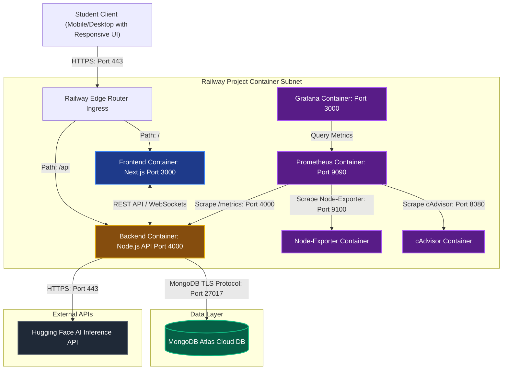
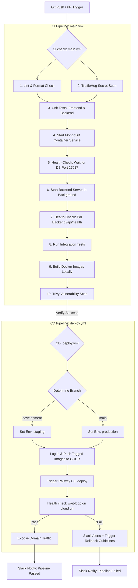
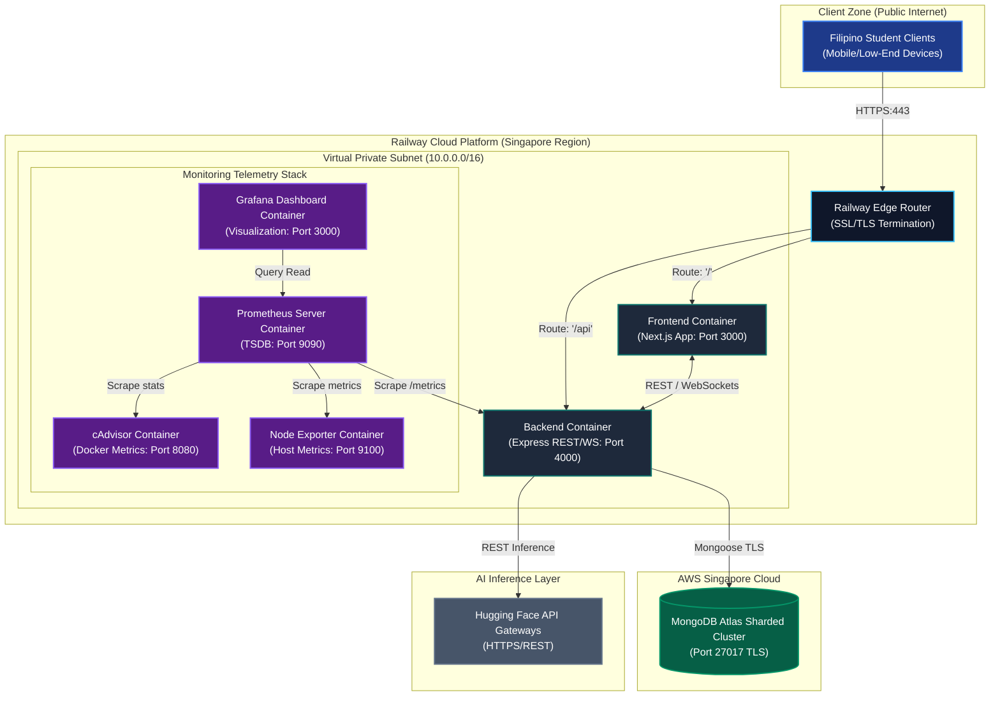
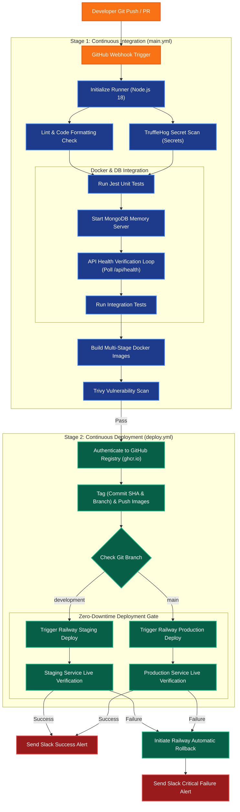
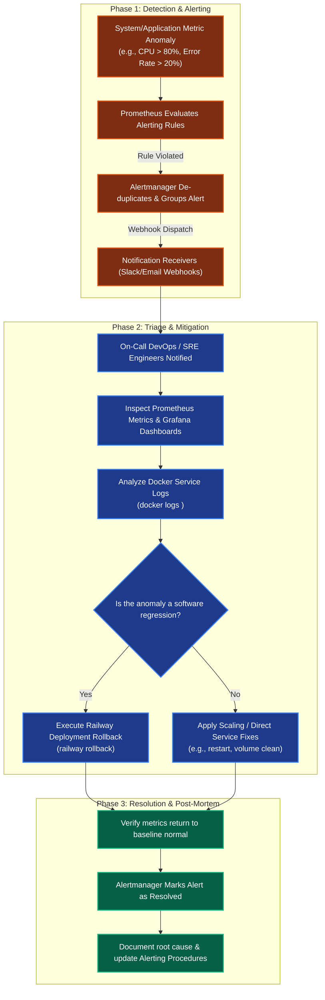

# BrainBytes AI Tutoring Platform: Capstone DevOps & Operations Manual

[](https://github.com/ShakiraCasusi/Brainbytes-AITutoring-Platform/actions/workflows/main.yml)

---

## Executive Summary
The BrainBytes project is an innovative, AI-powered tutoring application designed to resolve educational access and resource limitations faced by Filipino students. The system integrates advanced AI-driven subject tutoring with specialized web optimizations to handle low-end mobile hardware and unstable cellular networks. Through containerized services, automated continuous integration/deployment (CI/CD) pipelines, and real-time monitoring telemetry, the platform maintains system availability and performance under fluctuating user loads. Key outcomes of this work include successful multi-container configurations, automated testing gates, and data privacy standardizations.

* **Project purpose:** To deliver localized, low-latency, and accessible academic tutoring utilizing artificial intelligence for students facing hardware and internet bandwidth limitations.
* **Key features:** Interactive subject-specific AI tutoring (Mathematics, Science, History, English, and General), mobile-responsive off-canvas navigation layouts, Progressive Web Application (PWA) caching for offline resiliency, and theme settings.
* **DevOps integration:** Multi-container dockerization, multi-stage GitHub Actions CI/CD workflows, automated security scanning, and containerized deployment orchestrations.
* **Operational readiness:** Continuous rolling deployments on Railway, resource utilization auto-scaling, and a full monitoring telemetry stack providing proactive warning and critical alerts.

---

## Introduction

### Background
Students in the Philippines navigate a digital landscape marked by unstable mobile connectivity (frequently shifting between 3G, 4G, and variable 5G) and limited access to high-end devices. BrainBytes is structured to act as an optimized study companion that bridges these gaps. By utilizing Progressive Web App (PWA) caching via `next-pwa`, core application assets load instantly even under poor network conditions. To accommodate hardware resource constraints, compute-heavy tasks are shifted server-side, reducing client hydration and memory usage.

### Objectives
* Orchestrate the frontend, backend, and monitoring tools as isolated, resource-controlled containers.
* Automate testing and deployment workflows using robust health-check verification loops.
* Implement automated resource monitoring and alerting thresholds to anticipate traffic spikes during midterms and finals.
* Secure student personally identifiable information (PII) at rest and in transit, conforming to the Philippine Data Privacy Act of 2012.

### Scope & Limitations
The project covers the Next.js responsive user interface, the Express API backend, integration with the Hugging Face Inference API, and AWS-hosted MongoDB Atlas database management. It is limited to local sandbox simulated databases during external database outages, and depends on external AI model availability.

### Technologies Used
* **Containerization & Deployment:** Docker, Docker Compose, Railway.app
* **CI/CD Platform & Registry:** GitHub Actions, GitHub Container Registry (GHCR)
* **Monitoring Stack:** Prometheus, Grafana, cAdvisor, Node Exporter
* **Database & APIs:** MongoDB Atlas, Hugging Face Inference API

---

## System Architecture

### Overview
BrainBytes uses a decoupled client-server architecture. The user accesses the platform via a responsive browser client, which communicates via REST APIs and WebSockets with the backend server. The backend interacts with the database layer and external AI endpoints.

### Components
1. **Frontend (Next.js):** Client-side application featuring fluid layouts, horizontal tab scrolling, and a responsive navigation drawer.
2. **Backend (Node.js/Express):** Handles API routing, WebSocket real-time alerts, and AI prompt engineering.
3. **Database (MongoDB Atlas):** Hosted in the AWS Singapore region (`ap-southeast-1`) to minimize network latency to the Philippines.
4. **Monitoring Stack (Prometheus/Grafana):** Node Exporter and cAdvisor extract system/container metrics for Prometheus, which are visualized via Grafana.

### Interactions
The user requests transit through the Railway Edge Router ingress. The Frontend container handles browser routing, while the Backend container handles database queries and routes prompt queries to Hugging Face. The monitoring agents constantly scrape CPU, memory, and application statistics.

### Cloud Deployment
Multi-container staging and production instances are deployed within Railway virtual private clusters, utilizing rolling update deployment strategies.

### Diagram
The system architecture below details the container components and external network communication paths:



---

## DevOps Implementation

### Containerization Strategy
Frontend and backend microservices are built using multi-stage Dockerfiles. The build stage compiles the JS bundles and installs dependencies, while the runner stage copies only the production dependencies and built assets. This keeps the container footprint small and minimizes security attack surfaces.

### CI/CD Pipeline Workflow
Our consolidated workflows verify commits and automate deployments:



### Cloud Deployment Process
When container builds succeed, images are pushed to GitHub Container Registry (`ghcr.io`) and tagged by Git Commit SHA and branch name. A webhook updates the Railway environments, triggering a zero-downtime rolling update.

### Infrastructure as Code
System resource constraints, environment mappings, proxy whitelists, and database limits are stored in env-files and config declarations to ensure declarative environment consistency.

### Monitoring Setup
Prometheus is configured to scrape container health data via cAdvisor and Node Exporter. Application-level metrics are exported from the backend at the `/metrics` endpoint and parsed by Prometheus to evaluate active alerting rules.

The backend implements five custom metric types to provide business-level visibility beyond standard system metrics:
* **Counter — `brainbytes_ai_queries_total`:** Tracks total AI queries processed, labelled by subject category and success/error status.
* **Gauge — `brainbytes_active_sessions`:** Tracks the number of concurrent chat sessions currently being processed.
* **Histogram — `brainbytes_ai_response_duration_seconds`:** Measures AI response time in seconds with fine-grained buckets for percentile analysis.
* **Histogram — `brainbytes_chat_end_to_end_duration_seconds`:** Measures full user experience latency from message receipt to response delivered.
* **Counter — `brainbytes_errors_total`:** Tracks error distribution by type (`server_error`, `client_error`, `validation_error`, `db_error`) and severity.

---

## Operations Capability

### Resource Monitoring
We track system metrics to prevent degradation:
* **Host Metrics:** CPU load, memory utilization, disk IOPS.
* **Container Metrics:** Memory limits, CPU throttling, network traffic.
* **Application Metrics:** AI inference latency, active socket connections, database transaction status.

### Alerting
Prometheus Alertmanager evaluates the rules file and dispatches notifications based on the following thresholds:
* **ServiceDown:** Alert immediately if a container is unreachable for >1 minute.
* **HighMemoryUsage:** Alert if available system memory falls below 15% for >5 minutes.
* **HighCPUUsage:** Warning alert if CPU usage exceeds 80% for >5 minutes.
* **AIQueryErrorRate:** Alert warning if error rate exceeds 5%, and critical alert if it exceeds 20% in a 5-minute window.
* **AIResponseTime:** Alert if p95 response time exceeds 3 seconds (warning) or 8 seconds (critical).

Alerts are configured in two layers, warning thresholds for early detection and critical thresholds for immediate action:

| Alert | Warning Threshold | Critical Threshold |
| :--- | :--- | :--- |
| **AI query error rate** | >5% for 2m | >20% for 2m |
| **AI response time p95** | >3s for 2m | >8s for 2m |
| **HTTP error rate** | >5% for 2m | >15% for 2m |
| **DB query time p95** | >100ms for 3m | >500ms for 3m |

Business-level alerts monitor user experience and AI service health directly:
* **ChatExperienceDegraded (warning/critical)** — Triggers when p90 end-to-end chat latency exceeds 4s (warning) or 10s (critical), indicating users are experiencing slow responses.
* **AIServiceDegradation** — Triggers when more than 30% of AI responses return an error category over 10 minutes, indicating the AI service may be down.
* **AITimeoutRateHigh** — Triggers when AI service timeouts exceed 0.1 per second, indicating HuggingFace API connectivity issues.
* **AuthFailureSpike** — Triggers when login failures exceed 1 per second, used for brute force attack detection.
* **NoMessagesStored** — Triggers when no messages are saved to the database for 10 minutes during active hours, indicating the tutoring platform is not functioning.

### Performance Optimization
To maximize efficiency, the frontend uses relative styling units (`rem`, `%`, `vw`), CSS Flexbox, and grid layouts instead of fixed pixels. Stale Next.js cache configurations are handled automatically in the deployment pipelines, and remote databases run optimized query indexing.

### Incident Response Workflow

```
[Anomalous Metric] ──> (Prometheus Alert Trigger) ──> [Alert Receiver Notification] 
                                                                │
[Manual Verification & Fix] <── (Trigger Manual Rollback) <───┴──> [Rollback Guidelines]
```

1. **Detect:** Prometheus detects a violation of alerting rules.
2. **Alert:** Alertmanager sends details to the alert-receiver and posts alerts to channels.
3. **Resolve:** Engineers evaluate system state. If caused by a regression, run `railway rollback`.
4. **Document:** Write post-mortem documentation to prevent recurrence.

### Backup & Recovery Procedures
MongoDB Atlas executes automated daily snapshots. Restore routines can target database snapshots through the Atlas console. For deployment failures, automated rollbacks prevent routing to unhealthy containers.

### Documentation Set
The table below lists the documentation set for setup, monitoring, and troubleshooting tasks:

| Document Name | Location / Path | Purpose | Status |
| :--- | :--- | :--- | :--- |
| **Setup Guide** | [monitoring-docs/setup-guide.md](monitoring-docs/setup-guide.md) | Installation & deployment steps | Complete |
| **Operations Manual** | [docs/deployment-plan.md](docs/deployment-plan.md) | Daily ops, scaling, backups | Complete |
| **Monitoring Guide** | [prometheus/PROMETHEUS.md](prometheus/PROMETHEUS.md) | Dashboard navigation & metrics | Complete |
| **Troubleshooting Guide** | [monitoring-docs/alerting-guide.md](monitoring-docs/alerting-guide.md) | Common issues & fixes | Complete |
| **CI/CD Pipeline Reference** | [.github/workflows/main.yml](.github/workflows/main.yml) | Workflow YAML & explanation | Complete |
| **System Architecture Diagram** | [docs/system-architecture.md](docs/system-architecture.md) | Visual representation | Complete |
| **Testing Report** | [backend/tests/TEST_REPORT.md](backend/tests/TEST_REPORT.md) | Weekly test results, fixes, and findings | Complete |
| **Metric Dictionary** | [prometheus/METRIC_DICTIONARY.md](prometheus/METRIC_DICTIONARY.md) | Every metric with normal ranges and anomaly indicators | Complete |
| **Alert Procedures** | [prometheus/ALERT_PROCEDURES.md](prometheus/ALERT_PROCEDURES.md) | Step-by-step response for each alert | Complete |

---

## Testing and Validation

### Functional Testing
Unit tests are automated using Jest. 10/10 test cases pass cleanly across frontend and backend components.

```
PASS __tests__/ChatInput.test.js
PASS __tests__/MessageList.test.js
PASS __tests__/Chat.test.js
PASS __tests__/ChatInterface.test.js
```

### CI/CD Pipeline Tests
GitHub Actions successfully validates the workspace code, runs secret scans, launches a database health loop, runs the backend, and finishes Trivy vulnerability scans on every code submission.

### Monitoring Validation
Metrics are fetched successfully at the `/metrics` endpoint. Prometheus parses the data correctly, and Grafana maps metric trends over time.

### Performance Benchmarks
* **Client responsiveness:** Dynamic layouts adapt properly to 320px, 480px, 768px, 1024px, and 1280px breakpoints.
* **Database latency:** Under 50ms database operation latencies achieved via AWS Singapore cloud proximity.
* **Availability:** Rolling container replacements yield 100% uptime deployments.

---

## Challenges and Solutions

### Challenges Faced

#### Shirly Rose Montes
I encountered several challenges involving AI integration, backend development, monitoring, and deployment. The Hugging Face AI service initially failed because the inference endpoint was no longer functioning correctly. I also experienced Docker configuration and container networking issues and database connectivity problems. GitHub Actions and CI/CD pipeline failures due to missing modules and incorrect file names, Prometheus and Grafana monitoring issues where metrics were not displayed correctly, syntax errors in PromQL and alert rules, AlertManager integration challenges; and frontend Internal Server Errors during testing.

#### Jerico Gabriel Crisostomo
I encountered several challenges involving backend testing, API security, CI/CD configuration, and monitoring instrumentation. The Jest configuration file contained a typo in the `testMatch` pattern using single underscores instead of double underscores, which caused Jest to find no test files at all. Protected API routes for users, materials, settings, and activity were accessible without authentication tokens, exposing them to unauthenticated requests. The CI/CD pipeline used an unreliable fixed `sleep 5` delay after server startup, causing intermittent test failures when the server took longer to initialize. The `mongodb-memory-server` package exceeded Jest's default 5-second timeout on first run due to binary download time, causing all database tests to fail. The GitHub Actions deploy workflow used the secrets context directly inside `if:` conditions, which GitHub Actions does not allow for security reasons. Additionally, the `chatController` returned a generic 500 error instead of a meaningful 400 for Mongoose validation errors, making debugging difficult.

#### Shakira Angela Casusi
During local runs, Windows Node.js DNS resolution engines encountered `querySrv ECONNREFUSED` errors when looking up SRV records. Nodemon servers crashed with `EADDRINUSE` due to zombie processes holding ports 4000 and 8082. Mobile dimensions (320px–480px) caused text overflows, tab alignment overlaps, and form clipping.

### Solutions Applied

#### Shirly Rose Montes
To address these issues, I updated the Hugging Face model endpoint and reconfigured the AI service. I corrected the Docker Compose configuration, rebuilt the Docker containers, and verified service connectivity. I resolved CI/CD failures by renaming files correctly, fixing project paths, and ensuring all required files were committed to GitHub. For the monitoring system, I validated custom metrics, corrected PromQL queries and YAML configuration files, verified Prometheus scraping, and integrated Alertmanager by implementing alert models, controllers, routes, and webhook endpoints. I also debugged the frontend and backend using API health checks, Docker logs, and application logs to identify and resolve server-side errors.

#### Jerico Gabriel Crisostomo
To resolve these issues, I corrected the `jest.config.js` typo, added `testTimeout: 30000` and a 60-second `beforeAll` timeout to accommodate the binary download on first run, and excluded manual test files from the Jest runner using `testPathIgnorePatterns`. I applied the `requireAuth` middleware explicitly to all four protected routes in `app.js` to enforce authentication. I replaced the unreliable `sleep 5` in `ci.yml` with a 60-attempt health check polling loop that checks `/api/health` every second, ensuring the server is actually ready before tests run. For the GitHub Actions deploy workflow, I moved the secret existence check into a `run:` step that sets a `HAS_RAILWAY_TOKEN` environment variable, which is then safely referenced in `if:` conditions. I also added a `ValidationError` type check in the catch block of the message controller to return a proper 400 response for schema validation failures.

#### Shakira Angela Casusi
Configured direct connections targeting the cluster's replica shard hosts, bypassing the SRV record DNS bug in Node.js. Terminated zombie processes holding development ports. Redesigned responsive components using media queries, fluid rems, flexbox wrap configurations, and off-canvas slide-out drawers.

### Lessons Learned

#### Shirly Rose Montes
These experiences improved my understanding of AI integration, REST API development, Docker containerization, Git version control, CI/CD workflows, Prometheus and Grafana monitoring, Alertmanager integration, and systematic debugging. I learned the importance of carefully validating configurations, testing each component individually, using logs to identify issues efficiently, and maintaining a well-organized project structure. Most importantly, I realized that troubleshooting is an essential part of software development and that solving real-world technical problems significantly strengthens both technical and analytical skills.

#### Jerico Gabriel Crisostomo
These experiences reinforced the importance of test isolation, configuration accuracy, and security by default. Using `mongodb-memory-server` taught me that unit tests should never depend on external services — isolated tests are faster, more reliable, and runnable without Docker. I learned that monitoring is only valuable when custom metrics are actually instrumented in application code, since default system metrics alone provide no visibility into business behavior like AI response times or user session activity. The CI/CD issues highlighted that small configuration mistakes such as a typo or a fixed sleep timer can cause hours of debugging time that proper health checks and validation would prevent. Most importantly, I realized that applying security middleware explicitly per route rather than assuming it is inherited is a fundamental principle that must be verified through tests, not assumed.

#### Shakira Angela Casusi
Container architectures require robust port release scripts and connection fallback policies to maintain stability during local and cloud runs.

---

## Conclusion
The BrainBytes capstone platform demonstrates a production-ready application layout. Through automated pipelines, secure database routing, mobile-responsive layout architectures, and prometheus monitoring, the project provides a reliable personal AI tutor for Filipino students.

---

## Appendices

### 1. System Topology Diagram
The system topology diagram below outlines the container structures, virtual network parameters, metrics collection endpoints, and external API service boundaries within our localized development and Railway cloud container clusters:



### 2. CI/CD Pipeline Map Flowchart
The flowchart below maps out the continuous integration and continuous deployment pipelines, showing validation gates and environment-based deployments:



### 3. Incident Response Flow
The incident response diagram below maps the workflow for anomalous metric alerts, triage processes, rollback actions, and documentation closure:



### Team Responsibilities & Project Roles

| Team Member | Project Role | Core Responsibilities | Contact Email |
| :--- | :--- | :--- | :--- |
| **Shakira Angela Casusi** | Team Lead, Frontend Developer | Coordinates integration milestones, code reviews, architectural changes, and frontend development. | `lr.sacasusi@mmdc.mcl.edu.ph` |
| **Jerico Gabriel Crisostomo** | Backend Developer | Manages AI prompt routing, Express endpoints, and Mongoose database schemas. | `lr.jgcrisostomo@mmdc.mcl.edu.ph` |
| **Shirly Rose Montes** | DevOps Engineer | Maintains CI/CD pipelines, Docker configurations, cloud deployments, and registry pushes. | `lr.srmontes@mmdc.mcl.edu.ph` |
| **Juliana Martina Relox** | Frontend Developer | Assisted in initial frontend layout planning. | `lr.jmrelox@mmdc.mcl.edu.ph` |
