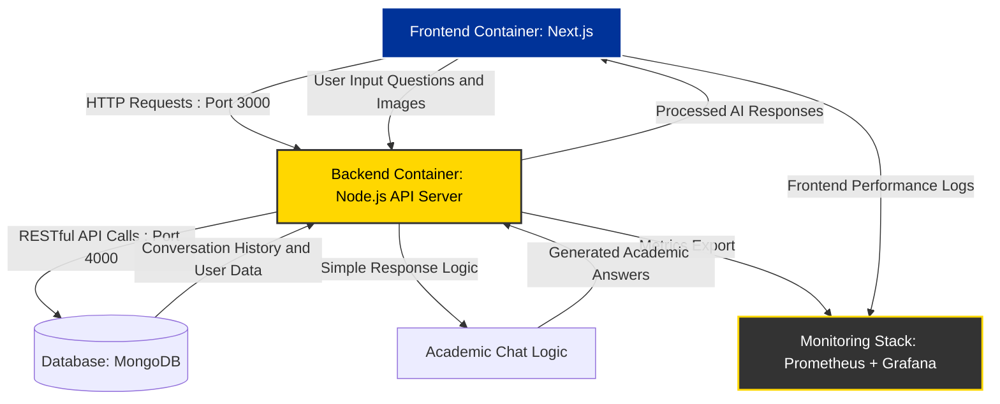

# BrainBytes AI Tutoring Platform

## Project Overview
BrainBytes is an AI-powered tutoring platform designed to provide accessible academic assistance to Filipino students. This project implements the platform using modern DevOps practices and containerization.

## Development Team
- [Shakira Angela Casusi] - Team Lead - [lr.sacasusi@mmdc.mcl.edu.ph]
- [Jerico Gabriel Crisostomo] - Backend Developer - [lr.jgcrisostomo@mmdc.mcl.edu.ph]
- [Juliana Martina Relox] - Frontend Developer - [lr.jmrelox@mmdc.mcl.edu.ph]
- [Shirly Rose Montes] - DevOps Engineer - [lr.srmontes@mmdc.mcl.edu.ph]

## Project Goals
- Implement a containerized application with proper networking
- Create an automated CI/CD pipeline using GitHub Actions
- Deploy the application to Oracle Cloud Free Tier
- Set up monitoring and observability tools

## Technology Stack
- Frontend: Next.js
- Backend: Node.js
- Database: MongoDB
- Containerization: Docker
- PWA: next-pwa
- Desktop: Electron and Electron Builder
- CI/CD: GitHub Actions
- Cloud Provider: Oracle Cloud Free Tier
- Monitoring: Prometheus & Grafana

## Project Architecture Diagram - Draft

### Project Architecture Diagram Draft - Components Explained

| **Component** | **Role / Function** | **Port** | **Data Flows** |
| --- | --- | --- | --- |
| **Frontend Container (Next.js)** | Provides the user interface (chat window, login/guest mode, conversation history). Optimized for mobile-first experience. | `3000` | - Sends HTTP requests to Backend - Receives processed AI responses - Logs frontend performance metrics to Monitoring |
| **Backend Container (Node.js API Server)** | Core application logic; handles chat requests, generates simple academic responses, and stores messages. | `4000` | - Receives user input from Frontend - Sends API calls to Database - Returns responses to Frontend |
| **Database (MongoDB)** | Stores conversation history in the containerized environment. | `27017` | - Receives API calls from Backend - Provides conversation history back to Backend |
| **Academic Chat Logic** | Generates basic responses using keyword matching. | In backend | - Receives user messages from Backend - Returns simple academic guidance |
| **Monitoring Stack (Prometheus + Grafana)** | Planned stack for system health and performance metrics. | Planned | - Receives metrics in future iterations |