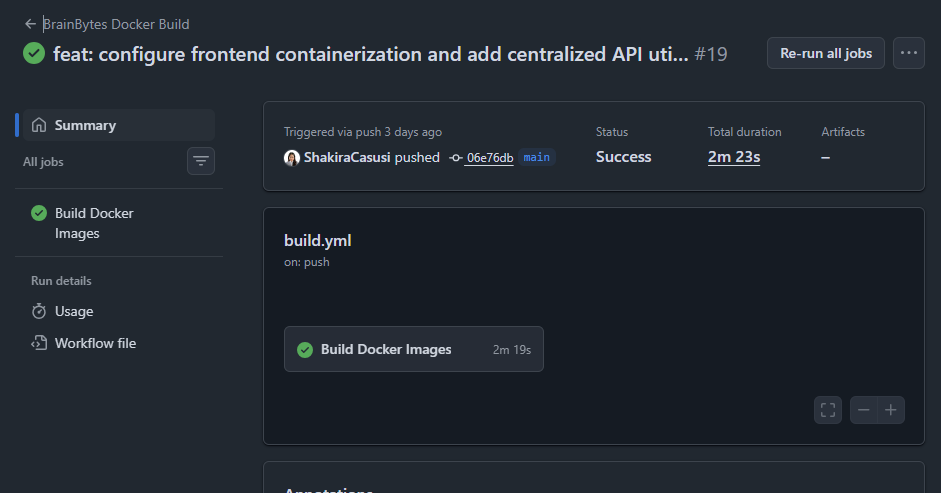
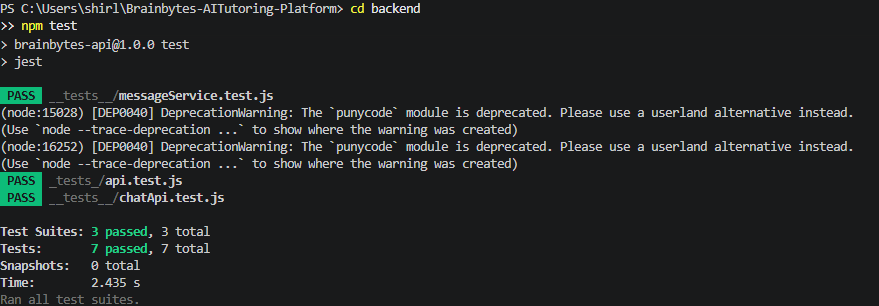
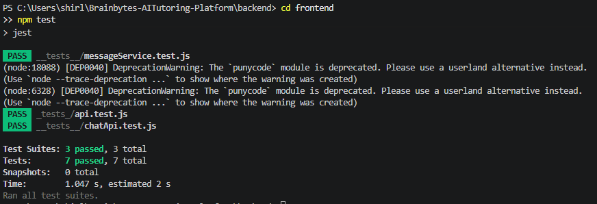
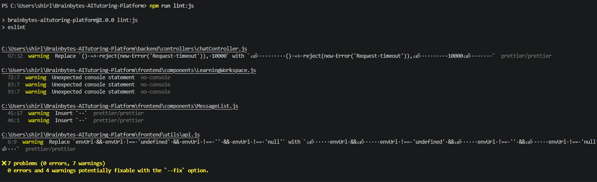
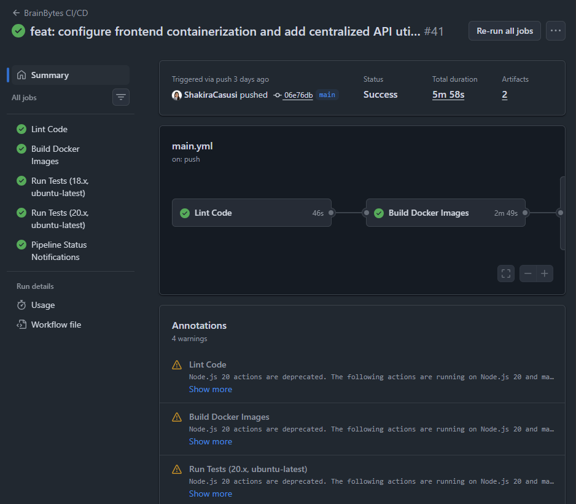
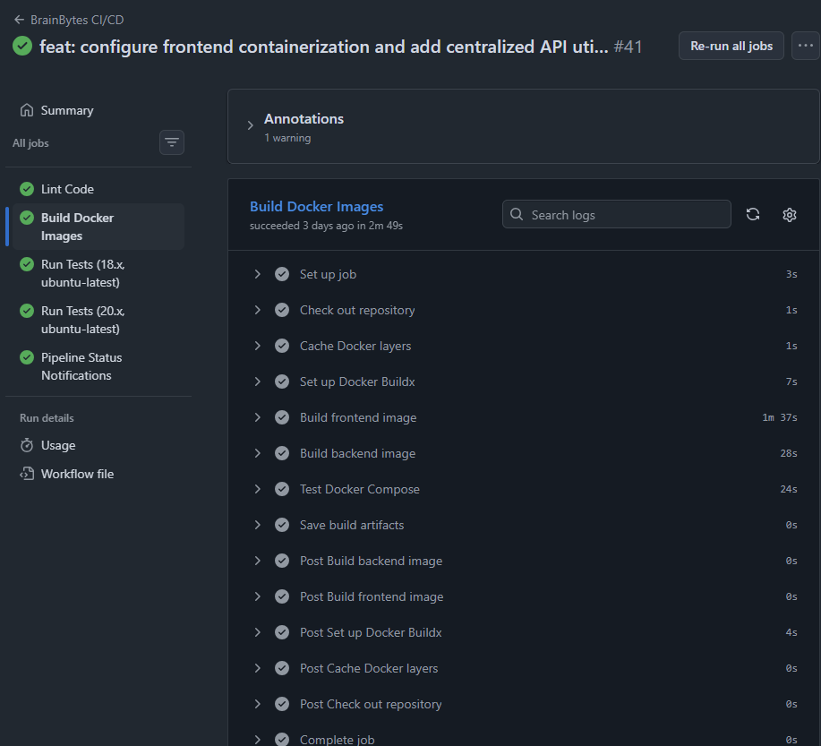

# BrainBytes AI Tutoring Platform

## CI/CD Pipeline DevOps Report

---

## 1. Overview

This document describes the CI/CD pipeline improvements implemented for the BrainBytes AI Tutoring Platform.
The goal was to automate testing, linting, building, and deployment using GitHub Actions.

---

## 2. CI/CD Workflow Summary

The project uses GitHub Actions to automatically run:

* Backend tests (Jest)
* Frontend tests (React/Next.js)
* ESLint code quality checks
* Docker image build
* Security scanning
* Artifact generation (test coverage reports)

Every push to the repository triggers the pipeline.

---

## 3. Parallel Job Execution

The CI/CD pipeline is structured into multiple jobs that run in parallel:

* Backend Tests
* Frontend Tests
* Linting (ESLint)
* Security Scan
* Docker Build

### Benefits:

* Faster execution time
* Independent job failure detection
* Improved pipeline efficiency

---

## 4. Dependency Caching

Caching was implemented using GitHub Actions to speed up builds.

Example:

```yaml
- uses: actions/setup-node@v4
  with:
    node-version: 20
    cache: npm
```

### Benefits:

* Faster npm installs
* Reduced CI/CD execution time
* Reusable dependency cache

---

## 5. Automated Testing

### Backend Tests

All backend tests pass successfully using Jest:

```
PASS __tests__/messageService.test.js
PASS _tests_/api.test.js
PASS __tests__/chatApi.test.js
```

* Test Suites: 3 passed
* Tests: 7 passed

---

### Frontend Tests

Frontend tests validate UI components and chat functionality.

Status:
All tests passing in CI/CD pipeline

---

## 6. ESLint Code Quality

ESLint is integrated into the pipeline to enforce code quality.

Result:

```
✔ 0 errors
⚠ warnings only
```

This ensures code consistency and prevents major bugs.

---

## 7. Test Artifacts

GitHub Actions generates and stores test reports as artifacts.

Example artifact:

* coverage-reports

These reports can be downloaded from the GitHub Actions workflow run.

---

## 8. Docker Build

The pipeline builds Docker images for:

* Backend service
* Frontend service

Status:
Docker build completed successfully in CI/CD pipeline

---

## 9. CI/CD Evidence (Screenshots)

### 9.1 GitHub Actions Successful Workflow Run



---

### 9.2 Backend Test Results



---

### 9.3 Frontend Test Results



---

### 9.4 ESLint Output



---

### 9.5 Test Artifacts



---

### 9.6 Docker Build Success



---

## 10. Summary

The CI/CD pipeline successfully automates:

* Testing (backend + frontend)
* Code quality checks (ESLint)
* Build verification (Docker)
* Artifact generation
* Parallel job execution
* Dependency caching

This improves development speed, reliability, and deployment confidence.

---


