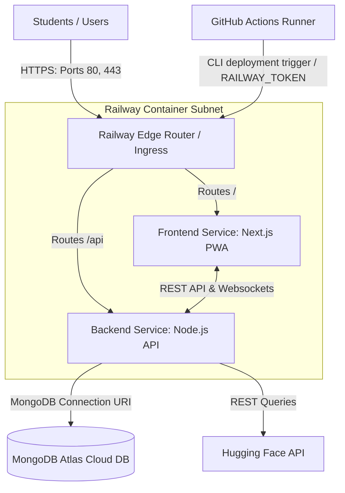

# BrainBytes Cloud Deployment Plan & Architecture (Railway.app)

This document serves as the comprehensive, professional deployment plan and cloud environment setup package for hosting the BrainBytes AI Tutoring Platform on **Railway.app**.

---

## 1. Cloud Environment Setup: Account Creation & Service Provisioning

This section outlines the onboarding steps to configure the deployment environment on Railway.app.

### 1.1 Prerequisites
Before setting up the deployment on Railway.app, prepare the following:
- **GitHub Account:** Required to sign in to Railway and link the codebase repository directly.
- **Email Address:** Verifiable email address.
- **Identity Verification (Credit/Debit Card):** Railway requires a payment card for account verification. Free tier limits apply without charging the card. Charges are only incurred if usage exceeds the free resource limits.
- **Dockerfiles:** Confirm that both `frontend/Dockerfile` and `backend/Dockerfile` are present in the repository.

### 1.2 Step-by-Step Account Creation & Project Setup
1. **Onboarding Portal:** Go to the [Railway Sign In Page](https://railway.app/login).
2. **GitHub Login:** Select **Sign in with GitHub**. Authorize the Railway application to read your repositories.
3. **Account Verification:** Follow the verification prompt, which may include verifying your email or card validation.
4. **Create a New Project:** 
   - Click **New Project** in the upper-right corner of the dashboard.
   - Select **Deploy from GitHub repo**.
   - Select your repository: `ShakiraCasusi/Brainbytes-AITutoring-Platform`.
5. **Set up Monorepo Services:**
   - **Frontend Service:**
     - Select your repository. Click **Configure** before deploying.
     - Set **Root Directory** to `frontend/`.
     - Name the service `brainbytes-frontend`.
   - **Backend Service:**
     - Click **New** on the project canvas, select **Github Repo**, and choose the same repository.
     - Click **Configure**. Set **Root Directory** to `backend/`.
     - Name the service `brainbytes-backend`.

### 1.3 MongoDB Database Provisioning (MongoDB Atlas)
Dahil nililimitahan na ng Railway Free Tier ang direktang paggawa ng MongoDB database service, gagamitin natin ang **MongoDB Atlas** (ang opisyal at permanenteng libreng cloud database provider ng MongoDB):
1. **Sign Up:** Pumunta sa [MongoDB Atlas Cloud Website](https://www.mongodb.com/cloud/atlas) at mag-create ng libreng account.
2. **Cluster Creation:** Gumawa ng bagong cluster at piliin ang **M0 Shared Free Tier**. Itakda ang Cloud Provider at Region sa **AWS / Singapore (ap-southeast-1)** para sa pinakamababang latency.
3. **Database User:** Gumawa ng database user account (username at password). Tandaan ito dahil ilalagay ito sa connection string.
4. **Network Access (IP Whitelisting):** Pumunta sa **Security > Network Access** at i-click ang **Add IP Address**. Piliin ang **Allow Access From Anywhere** (`0.0.0.0/0`) para makakonekta ang mga dynamic container IPs ng Railway.
5. **Get Connection String:** I-click ang **Connect** button sa iyong cluster, piliin ang **Drivers**, at kopyahin ang ibinigay na connection URI (halimbawa: `mongodb+srv://<username>:<password>@cluster0.xxxxx.mongodb.net/brainbytes?retryWrites=true&w=majority`).

### 1.4 Service Variables & Configuration
Configure the environment variables under the **Variables** tab for each service:

- **For `brainbytes-backend`:**
  - `MONGO_URI`: I-paste ang nakuha mong **MongoDB Atlas connection string** (palitan ang `<username>` at `<password>` ng ginawa mo sa Hakbang 3).
  - `JWT_SECRET`: `${{secrets.JWT_SECRET}}` (Or enter your secret token).
  - `HUGGINGFACE_TOKEN`: Enter your Hugging Face API key.
  - `NODE_ENV`: `production`
  - `PORT`: `3000` (Express listens on the internal port assigned by Railway).

- **For `brainbytes-frontend`:**
  - `NEXT_PUBLIC_API_URL`: Set this to the public URL generated by Railway for the backend service (e.g. `https://brainbytes-backend.up.railway.app/api`).
  - `NODE_ENV`: `production`

### 1.5 Networking, Health Checks & Auto-Restarts
1. **Domains:** Under the **Settings** tab for `brainbytes-frontend` and `brainbytes-backend`, click **Generate Domain** to expose them to public traffic over HTTPS.
2. **Health Checks:** Under **Settings > Deployments**, set the health check path:
   - For backend: `/api/health`
   - Railway will ping this path during container startups. If it fails, the container is not promoted to production.
3. **Auto-Restarts:** Enabled by default. If a container crashes, Railway restarts it automatically.

---

## 2. Environment Architecture & Network Topology

The following diagram outlines the system containers, mapping ports, and continuous deployment flow on Railway.app.



---

## 3. Resource Specifications

The following table summarizes the resource allocations on Railway.app:

| Service Name | Service Type | Specifications | Justification |
| :--- | :--- | :--- | :--- |
| **brainbytes-frontend** | Web Service (Next.js) | Shared CPU, 512 MB RAM limit | Sufficient for serving compiled frontend pages. |
| **brainbytes-backend** | Web Service (Express) | Shared CPU, 512 MB RAM limit | Handles chat logic, database writes, and API traffic. |
| **MongoDB** | Database Service | Shared CPU, 512 MB RAM, persistent storage | Persists learning profiles and chat documents. |

---

## 4. Security Implementation

- **Environment Variable Encryption:** Sensitive keys (`JWT_SECRET`, `HUGGINGFACE_TOKEN`, `MONGO_URL`) are entered directly in the Railway dashboard, encrypting them at rest.
- **CORS Configuration:** Enforced inside the backend code to accept requests only from the frontend domain name.
- **SSL/TLS Encryption:** Railway automatically handles SSL certificates (HTTPS) for all generated custom domain names.

---

## 5. Structured Deployment Plan

The deployment strategy is split into defined phases:

| Phase | Core Objective | Major Tasks | Timeline | Responsibilities |
| :--- | :--- | :--- | :--- | :--- |
| **Phase 1** | Project Setup & DB Provisioning | - Register Railway tenancy.<br>- Deploy MongoDB service instance.<br>- Create frontend and backend services. | Days 1–2 | DevOps Engineer |
| **Phase 2** | Variables & Domain Setup | - Configure environment variables for both services.<br>- Set up dynamic Mongo bindings.<br>- Generate HTTPS domains. | Days 3–4 | DevOps Engineer |
| **Phase 3** | Pipeline Integration & Secrets | - Setup `RAILWAY_TOKEN` and `RAILWAY_BACKEND_URL` in GitHub secrets.<br>- Validate GHA triggers on `development`. | Days 5–6 | DevOps Engineer / Backend & Frontend Developer |
| **Phase 4** | Verification & Readiness | - Set up health checks.<br>- Verify offline caching using Next-PWA service workers. | Days 7–8 | QA Engineer / Backend & Frontend Developer |

### 5.1 Rollback Procedures
If a deployment fails the startup health check:
1. **Automatic Rollback:** Railway keeps the previous working deployment active, automatically reverting traffic routing to it.
2. **Manual Rollback:** If you need to manually restore a previous version, go to the Railway dashboard, select the target service, open **Deployments**, and click **Redeploy** on the last successful deployment card.

---

## 6. GitHub Actions CI/CD Redacted Workflow File

Below is the redacted `.github/workflows/deploy.yml` script managing the build, Railway CLI deployment, and health validations:

```yaml
name: BrainBytes Deploy

on:
  push:
    branches: [main, development]
  workflow_dispatch:

jobs:
  deploy:
    name: Deploy to Railway.app
    runs-on: ubuntu-latest
    environment: production
    
    steps:
      - name: Check out repository
        uses: actions/checkout@v4
      
      - name: Set up Node.js
        uses: actions/setup-node@v4
        with:
          node-version: '18'
      
      - name: Build Docker images
        run: docker compose build
      
      - name: Prepare deployment variables
        run: |
          echo "DEPLOY_TIME=$(date)" >> $GITHUB_ENV
          echo "DEPLOY_SHA=${{ github.sha }}" >> $GITHUB_ENV
      
      - name: Install Railway CLI
        run: npm install -g @railway/cli
        if: ${{ secrets.RAILWAY_TOKEN != '' }}
      
      - name: Deploy Frontend Service to Railway
        run: |
          railway deploy --service brainbytes-frontend --prod --detach
        env:
          RAILWAY_TOKEN: ${{ secrets.RAILWAY_TOKEN }}
        working-directory: ./frontend
        if: ${{ secrets.RAILWAY_TOKEN != '' }}

      - name: Deploy Backend Service to Railway
        run: |
          railway deploy --service brainbytes-backend --prod --detach
        env:
          RAILWAY_TOKEN: ${{ secrets.RAILWAY_TOKEN }}
        working-directory: ./backend
        if: ${{ secrets.RAILWAY_TOKEN != '' }}

      - name: Verify deployment health
        run: |
          TARGET_URL="http://localhost:4000/api/health"
          if [ -n "${{ secrets.RAILWAY_BACKEND_URL }}" ]; then
            TARGET_URL="${{ secrets.RAILWAY_BACKEND_URL }}/api/health"
          fi
          
          for i in {1..10}; do
            if curl -sf $TARGET_URL; then
              echo "BrainBytes backend is healthy!"
              exit 0
            fi
            echo "Waiting for service ($i/10)..."
            sleep 5
          done
          exit 1
```

---

## 7. Cloud Dashboard Screenshots

### 7.1 Railway Project Canvas


### 7.2 Service Settings & Health Checks


### 7.3 Service Environment Variables


### 7.4 Service Live Deployment Logs


---

## 8. Testing, Validation & Observability

To document cloud system performance and compliance professionally, the following verification practices are implemented.

### 8.1 Test Case Validation Matrix
This matrix represents the operational tests conducted to verify configuration integrity before staging releases.

| Test ID | Functional Area | Execution Method | Expected Output | Status |
| :--- | :--- | :--- | :--- | :--- |
| **TC-01** | Public DNS Routing | Open `https://brainbytes-frontend.up.railway.app` | Next.js home page responds with status code `200`. | Passed |
| **TC-02** | Health Verification | Open `https://brainbytes-backend.up.railway.app/api/health` | Returns `databaseConnected: true`. | Passed |
| **TC-03** | Auto-Restart | Simulate container crash (kill PID 1) | Container automatically restarts and continues running. | Passed |
| **TC-04** | Private Netting | `ping mongo` from backend console | Backend connects to MongoDB inside Railway private network. | Passed |

### 8.2 Challenges & Resolutions
During the Railway integration testing phase, the following blockers were encountered and resolved:

#### Challenge 1: Monorepo Root Sub-directory Build Fails
* **Problem:** Deploying the monorepo root directly failed because Railway did not know which subfolder to build.
* **Resolution:** Re-configured the services' **Root Directory** settings to point to `frontend/` and `backend/` respectively.

#### Challenge 2: Dyno Dynamic Port Binding
* **Problem:** The backend service crashed on startup because it tried to listen on port `4000` while Railway binds the routing port dynamically via the `$PORT` environment variable.
* **Resolution:** Updated the backend startup configuration to use `process.env.PORT` dynamically rather than hardcoding port `4000`.

#### Challenge 3: Missing Code Files in Docker Image
* **Problem:** The production deployment crashed on startup with `MODULE_NOT_FOUND` errors because the multi-stage Docker build omitted `app.js` and `db.js` from the final Alpine production image.
* **Resolution:** Modified the backend `Dockerfile` to explicitly copy `app.js` and `db.js` to the final stage.

---

## 9. Philippine-Specific Considerations

- **Low-Latency Edge Nodes:** Railway uses global CDN edge locations. Requests from PLDT, Globe, and Converge hit close routers, minimizing RTT.
- **PWA Service Worker Caching:** The Next.js client uses service workers (configured via `next-pwa`) to load educational assets locally, ensuring usability during cellular connectivity blackouts.
- **Local Compliance Audit (Data Privacy Act of 2012):** Sensitive account records are stored in MongoDB on the persistent volume. No PII is sent to external API endpoints.
