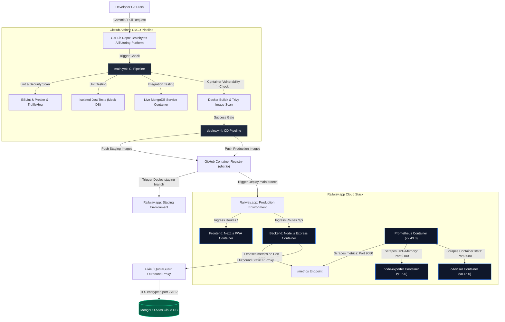

# BrainBytes CI/CD System Architecture

## Overview
The **BrainBytes AI Tutoring Platform** is a containerized multi-service web application designed to support Filipino students. The architecture leverages high-availability containers, automated deployment pipelines, and persistent database clustering. It is built as a Node.js Express backend and a Next.js frontend, integrated with a MongoDB Atlas database, and monitored using a Prometheus monitoring stack (Prometheus, node-exporter, cAdvisor).

---

## Architecture Diagram

The diagram below details the integration between developer actions, CI/CD pipeline automation, and multi-environment cloud resource deployments:

---

## Components

### 1. Source Control
- **Repository:** `https://github.com/ShakiraCasusi/Brainbytes-AITutoring-Platform`
- **Branch Structure:**
  - `main`: Reflects the production-ready state of the application. Commits merged here are deployed directly to the Production environment.
  - `development`: Tracks feature development and staging integrations. Commits pushed here are automatically deployed to the Staging environment for verification.
- **Protection Rules:**
  - Mandatory Pull Request code reviews before merging into protected branches.
  - Require status checks to pass before merging, specifically ESLint linting, TruffleHog secret scanning, and Jest unit and integration tests.
  - Deletions and force-pushes are strictly blocked on both branches.

### 2. CI/CD Pipeline
- **Platform:** GitHub Actions
- **Workflow Files:**
  - `main.yml`: Executes Lint checks, Secret scanning (TruffleHog), Unit tests in isolation using Jest mocks, Integration tests (utilizing a local MongoDB container service), and local Docker Buildx builds analyzed by Trivy container scanners.
  - `deploy.yml`: Logs in to GHCR, compiles and pushes tagged Docker images (`sha-<commit-sha>`, branch name, and `latest` for prod), executes Railway CLI deployments, pings endpoint health wait-loops, and handles alerts and rollback recommendations on failure.
- **Pipeline Stages:**
  1. **Linting & Code Quality:** Syntax checks using ESLint and Prettier.
  2. **Secret Auditing:** Historical scanning for hardcoded tokens using TruffleHog.
  3. **Unit Tests:** Mock-based test executions for frontend and backend in isolation.
  4. **Integration Tests:** Local service-container verification against a real database instance, using health check polling retry loops.
  5. **Vulnerability Checks:** Trivy scanning on compiled microservice images.
  6. **Build & Release:** Production-ready compilation and push to GHCR.
  7. **Cloud Deployment:** Orchestration of dynamic container deploys on Railway.app.

### 3. Cloud Infrastructure
- **Cloud Provider:** Railway.app & MongoDB Atlas (Cloud Database Provider)
- **Resources:**
  - `brainbytes-frontend`: Next.js web application server.
  - `brainbytes-backend`: Express Node.js API server.
  - `prometheus`: Scrapes and stores time-series system metrics.
  - `node-exporter`: Exposes system-level OS parameters.
  - `cadvisor`: Exposes container resource consumption.
  - `mongo`: Persistent storage layers.
- **Networking:**
  - Private routing inside the Railway internal network for frontend-to-backend communication.
  - Inbound database access on MongoDB Atlas is restricted to outbound static IP egress proxies (Fixie/QuotaGuard) provisioned for the backend web services.

---

## Component Interactions
1. **User Request Routing:** The student client issues requests that hit the Railway Edge Router over HTTPS (Port 443). The Edge Router splits traffic: routing frontend pages to `brainbytes-frontend` and API calls (`/api/*`) to `brainbytes-backend`.
2. **Database Queries:** The backend service routes traffic through the static proxy IP, which maps to MongoDB Atlas port 27017 using a secure TLS connection string.
3. **AI Generation:** The backend interacts with the Hugging Face AI API to generate tutoring hints and subject classifications.
4. **Metrics Collection:** The backend runs a dedicated metrics listener on port `9080` (separate from the API listener). Prometheus queries `backend:9080/metrics`, `node-exporter:9100/metrics`, and `cadvisor:8080/metrics` every 15 seconds, storing CPU, RAM, and application-specific metrics.

---

## Security Considerations
- **Environment Secrets Encryption:** API keys, database strings, and salts are stored securely within Railway's Secret Manager and injected at runtime.
- **Pipeline Scanning:** All code updates undergo automatic scanning (Prettier/ESLint, Snyk vulnerability analysis, TruffleHog credential audits, and Trivy base image scans).
- **Network Lockdown:** Public internet database connections are blocked. Whitelists are restricted strictly to proxy egress static IPs.
- **Header Hardening:** Express backend endpoints use Helmet middleware to configure secure HTTP headers (CORS, CSP, XSS protection).
