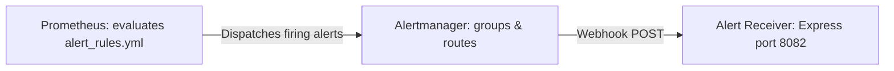

# BrainBytes Alert Rules & Incident Management Guide

This guide documents the alerting topology, metric thresholds, routing rules, and incident levels configured on the **BrainBytes AI Tutoring Platform**.

---

## 1. Alerting Infrastructure & Routing

We use **Prometheus** to evaluate alert expressions and **Alertmanager** to group, inhibit, and dispatch notifications.

### 1.1 Alert Grouping
Alertmanager batch-processes alerts to prevent notification storms during system outages:
* **Grouping criteria:** `{alertname, job}` — alerts with the same name and container job are aggregated together.
* **group_wait (30s):** The initial delay before dispatching the first notification, allowing related container alerts to batch together.
* **group_interval (5m):** The delay before sending updates about new alerts added to an existing active group.
* **repeat_interval (4h):** The re-notification frequency for alerts that remain unresolved.

### 1.2 Inhibition Rules
To reduce alert fatigue and noise during outages, we enforce inhibition rules:
* If a **Critical** alert is active on a specific container instance (e.g. `BackendDown`), it silences and inhibits any **Warning** alerts for the same instance (e.g. `SlowResponses` or `HighCPUUsage`).

### 1.3 Webhook Notification Dispatcher
All notifications route to our Express alert receiver:
* **Webhook Endpoint:** `http://backend:8082/alert` (active internal docker route).
* **Alert Receiver Logic:** A separate server running on port `8082` inside the backend container captures POST payloads and logs them to stdout (`console.log`) for audits.

---

## 2. Infrastructure & System Health Alerts

### 2.1 ServiceDown (Critical)
* **Expression:** `up == 0`
* **Evaluation Period:** 1 minute.
* **Justification:** Flags container process halts (e.g. backend crashing or Prometheus losing connection).
* **Reference SOP:** [alert-procedures.md](file:///c:/Users/krscu/OneDrive/Dokumen/brainbytes-multi-containers/monitoring-docs/alerts/alert-procedures.md#servicedown)

### 2.2 HighCPUUsage (Warning)
* **Expression:** `100 - (avg by (instance) (rate(node_cpu_seconds_total{mode="idle"}[5m])) * 100) > 80`
* **Evaluation Period:** 5 minutes.
* **Justification:** Host CPU exhaustion degrades request response times.
* **Reference SOP:** [alert-procedures.md](file:///c:/Users/krscu/OneDrive/Dokumen/brainbytes-multi-containers/monitoring-docs/alerts/alert-procedures.md#highcpuusage)

### 2.3 HighMemoryUsage (Critical)
* **Expression:** `(1 - (node_memory_MemAvailable_bytes / node_memory_MemTotal_bytes)) * 100 > 85`
* **Evaluation Period:** 5 minutes.
* **Justification:** Protects the host from disk thrashing or memory freeze conditions.
* **Reference SOP:** [alert-procedures.md](file:///c:/Users/krscu/OneDrive/Dokumen/brainbytes-multi-containers/monitoring-docs/alerts/alert-procedures.md#highmemoryusage)

### 2.4 LowDiskSpace (Warning)
* **Expression:** `(node_filesystem_avail_bytes{mountpoint="/"} / node_filesystem_size_bytes{mountpoint="/"}) * 100 < 15`
* **Evaluation Period:** 5 minutes.
* **Justification:** Out-of-disk space freezes MongoDB writes and database transactions.
* **Reference SOP:** [alert-procedures.md](file:///c:/Users/krscu/OneDrive/Dokumen/brainbytes-multi-containers/monitoring-docs/alerts/alert-procedures.md#lowdiskspace)

### 2.5 ContainerHighMemoryUsage (Warning)
* **Expression:** `(container_memory_usage_bytes{name=~"brainbytes-.*"} / container_spec_memory_limit_bytes{name=~"brainbytes-.*"}) * 100 > 85`
* **Evaluation Period:** 5 minutes.
* **Justification:** Node.js backend limits are capped at 512MB inside Docker Compose; this warns of memory leaks before container OOM-killer termination.
* **Reference SOP:** [alert-procedures.md](file:///c:/Users/krscu/OneDrive/Dokumen/brainbytes-multi-containers/monitoring-docs/alerts/alert-procedures.md#containerhighmemoryusage)

---

## 3. Application API Latency & Error Alerts

### 3.1 HTTP Server Error Rates (Layered)
* **Warning Threshold:** HTTP 5xx errors exceed **5%** of throughput for 2 minutes.
  * **Expression:** `(sum(rate(brainbytes_http_requests_total{status=~"5.."}[5m])) / sum(rate(brainbytes_http_requests_total[5m]))) * 100 > 5`
* **Critical Threshold:** HTTP 5xx errors exceed **15%** of throughput for 2 minutes.
  * **Expression:** `(sum(rate(brainbytes_http_requests_total{status=~"5.."}[5m])) / sum(rate(brainbytes_http_requests_total[5m]))) * 100 > 15`
* **Justification:** Protects user sessions from unhandled runtime bugs or database disconnection loops.
* **Reference SOP:** [alert-procedures.md](file:///c:/Users/krscu/OneDrive/Dokumen/brainbytes-multi-containers/monitoring-docs/alerts/alert-procedures.md#httperrorratewarning--httperrorratecritical)

### 3.2 Database Latency (Layered)
* **Warning Threshold:** 95% of MongoDB queries exceed **100ms** for 3 minutes.
  * **Expression:** `histogram_quantile(0.95, rate(brainbytes_db_query_duration_seconds_bucket[5m])) > 0.1`
* **Critical Threshold:** 95% of MongoDB queries exceed **500ms** for 3 minutes.
  * **Expression:** `histogram_quantile(0.95, rate(brainbytes_db_query_duration_seconds_bucket[5m])) > 0.5`
* **Justification:** Unindexed schema collections throttle active student tutoring chat threads.
* **Reference SOP:** [alert-procedures.md](file:///c:/Users/krscu/OneDrive/Dokumen/brainbytes-multi-containers/monitoring-docs/alerts/alert-procedures.md#dbqueryslowwarning--dbqueryslowcritical)

---

## 4. AI Tutoring & Business Operations Alerts

### 4.1 AI Query Errors (Layered)
* **Warning Threshold:** Over **5%** of Hugging Face queries fail within 2 minutes.
  * **Expression:** `rate(brainbytes_ai_queries_total{status="error"}[5m]) / rate(brainbytes_ai_queries_total[5m]) > 0.05`
* **Critical Threshold:** Over **20%** of Hugging Face queries fail within 2 minutes.
  * **Expression:** `rate(brainbytes_ai_queries_total{status="error"}[5m]) / rate(brainbytes_ai_queries_total[5m]) > 0.20`
* **Justification:** Flags Hugging Face Inference API down conditions or expired authorization tokens.
* **Reference SOP:** [alert-procedures.md](file:///c:/Users/krscu/OneDrive/Dokumen/brainbytes-multi-containers/monitoring-docs/alerts/alert-procedures.md#aiqueryerrorratewarning--aiqueryerrorratecritical)

### 4.2 AI Hints Latency (Layered)
* **Warning Threshold:** 95% of AI responses exceed **3s** for 2 minutes.
  * **Expression:** `histogram_quantile(0.95, rate(brainbytes_ai_response_duration_seconds_bucket[5m])) > 3`
* **Critical Threshold:** 95% of AI responses exceed **8s** for 2 minutes.
  * **Expression:** `histogram_quantile(0.95, rate(brainbytes_ai_response_duration_seconds_bucket[5m])) > 8`
* **Justification:** Tracks AI generation lag which degrades student flow and leads to connection timeouts.
* **Reference SOP:** [alert-procedures.md](file:///c:/Users/krscu/OneDrive/Dokumen/brainbytes-multi-containers/monitoring-docs/alerts/alert-procedures.md#airesponsetimewarning--airesponsetimecritical)

### 4.3 Tutor Session Activity Alerts
* **No Active Sessions (Warning):** Zero sessions for 30 minutes.
  * **Expression:** `brainbytes_active_sessions == 0`
  * **Justification:** A complete lack of tutoring traffic during Philippine school hours suggests client-side connectivity problems.
* **High Active Sessions (Warning):** Sessions exceed 20 concurrent students.
  * **Expression:** `brainbytes_active_sessions > 20`
  * **Justification:** Signals potential capacity overload on database resources.

---

## 5. Philippine Context Optimization Rules

### 5.1 Network Instability (Warning)
* **Expression:** `rate(brainbytes_connection_drops_total[5m]) > 5`
* **Evaluation Period:** 5 minutes.
* **Justification:** Identifies high reconnection attempts from mobile data networks.
* **Reference SOP:** [alert-procedures.md](file:///c:/Users/krscu/OneDrive/Dokumen/brainbytes-multi-containers/monitoring-docs/alerts/alert-procedures.md#networkinstability)

### 5.2 Slow Mobile Responses (Warning)
* **Expression:** `histogram_quantile(0.95, sum(rate(brainbytes_http_request_duration_seconds_bucket{user_agent=~".*Mobile.*"}[5m])) by (le)) > 3`
* **Evaluation Period:** 5 minutes.
* **Justification:** Keeps track of cellular performance, isolating mobile latency thresholds separate from high-speed desktop lines.
* **Reference SOP:** [alert-procedures.md](file:///c:/Users/krscu/OneDrive/Dokumen/brainbytes-multi-containers/monitoring-docs/alerts/alert-procedures.md#slowmobileresponses)

### 5.3 HighDataUsage (Warning)
* **Expression:** `sum(rate(brainbytes_response_size_bytes_sum[1h])) > 52428800`
* **Evaluation Period:** 15 minutes.
* **Justification:** Outbound payload sizes exceeding 50MB/hour drains prepaid mobile student balances.
* **Reference SOP:** [alert-procedures.md](file:///c:/Users/krscu/OneDrive/Dokumen/brainbytes-multi-containers/monitoring-docs/alerts/alert-procedures.md#highdatausage)
