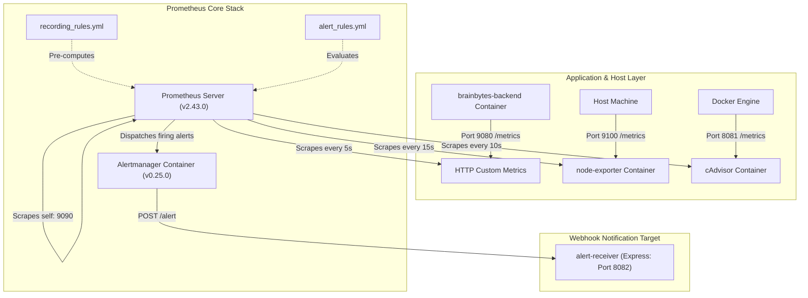

# BrainBytes Monitoring System Architecture

This document describes the structure, data flow, and components of the monitoring system implemented for the **BrainBytes AI Tutoring Platform**.

---

## Architecture Diagram

The monitoring system leverages a multi-container environment where Prometheus scrapes metrics from different services, evaluates them against pre-defined rules, and dispatches firing alerts to Alertmanager:

---

## Monitored Components

### 1. Prometheus Server (`v2.43.0`)
- **Role:** Central time-series database and query engine.
- **Responsibility:** Periodically pulls (scrapes) metrics from registered targets, stores data on the persistent `prometheus_data` volume, runs PromQL queries, evaluates alert rules, and fires notifications.

### 2. Node Exporter (`v1.5.0`)
- **Role:** Host OS metrics collector.
- **Responsibility:** Runs inside a privileged container with read-only access to `/proc`, `/sys`, and `/` directories of the host. Gathers low-level operating system parameters such as CPU load averages, disk read/write statistics, memory buffers, and network card packet transmissions.

### 3. cAdvisor (`v0.45.0`)
- **Role:** Container resource analyzer.
- **Responsibility:** Integrates directly with the host's Docker socket and `/var/lib/docker/` runtime path. Exposes per-container CPU utilization, active memory page allocations, socket buffers, and network interfaces for all running containers.

### 4. Alertmanager (`v0.25.0`)
- **Role:** Alert routing, deduplication, and suppression engine.
- **Responsibility:** Listens for firing alerts sent by Prometheus. Groups alerts by alertname and job, waits 30 seconds to catch simultaneous issues, suppresses lower-priority warnings if a critical warning is active on the same node, and routes notifications to the configured receiver.

### 5. Alert Receiver Webhook Server
- **Role:** Webhook endpoint.
- **Responsibility:** A lightweight Express JS endpoint running on port `8082` internally within the `brainbytes-backend` container. Listens for POST requests at `/alert` and logs details of the active alerts directly to the Node process stdout log for audits.

---

## Data Flow

1. **Instrumentation:**
   The backend Express JS application uses the `prom-client` module. Custom counters, summaries, and histograms increment or record data on active tutoring sessions, request response sizes, user-agents, and connection drop conditions.
2. **Exposition:**
   The custom metrics are gathered on a separate Express application inside the backend container and exposed on a dedicated metrics port `9080` at the `/metrics` path. Node Exporter (port 9100) and cAdvisor (port 8080) expose metrics in the same Prometheus exposition format.
3. **Scraping (Pulling):**
   Prometheus pulls text-based data from the scrapable endpoints at specific intervals (5s for backend metrics, 10s for container metrics, and 15s for host system metrics).
4. **Processing & Rules Storage:**
   Prometheus processes the incoming streams. It runs the pre-configured rules inside `recording_rules.yml` every 30 seconds to cache average latencies. It evaluates the expressions in `alert_rules.yml` every 15 seconds.
5. **Alerting Pipeline:**
   When an expression evaluates to true (e.g. error rate > 5%), the alert enters the `Pending` state. If the condition persists for the duration specified in the `for` clause (e.g. 2 minutes), the alert transitions to the `Firing` state and is dispatched to Alertmanager. Alertmanager resolves deduplications and issues a POST to the `alert-receiver` at `http://backend:8082/alert`.

---

## Operational Policies

### 1. Data Retention Policy
* **TSDB Storage Capacity:** Managed inside `docker-compose.yml` via the `--storage.tsdb.retention.time=15d` parameter.
* **Storage Limit:** Automatically prunes telemetry files older than 15 days, capping disk footprint on the host system to prevent system lockups.

### 2. Performance Considerations
* **Scrape Schedules:** Tailored to target severity:
  * Backend API metrics scraped every **5s** for high UX fidelity.
  * Docker container cAdvisor metrics scraped every **10s**.
  * Host operating system exporter metrics scraped every **15s**.
* **Precomputation Recording Rules:** Complex time-series PromQL formulas (like 5-minute HTTP error rates and average AI latency) are computed every 30 seconds by the Prometheus server and saved as cached metrics (`job:brainbytes_http_error_rate:5m`). Grafana reads these precomputed indexes directly, eliminating runtime latency during dashboard loads.

### 3. Security & Access Boundaries
* **Compliance (DPA 2012):** All telemetry metrics contain **zero** Personally Identifiable Information (PII). Student usernames, email addresses, and tutoring chat conversation texts are fully excluded from Prometheus labels.
* **Network Isolation:** The Prometheus console, cAdvisor, and Alertmanager metrics endpoints are locked behind internal Docker networks, accessible only through the host boundary via localhost.
* **Secure Database Access:** Mongoose connection strings use secure authentication parameters. Outbound telemetry data transfer rates are monitored to prevent data leak conditions.
