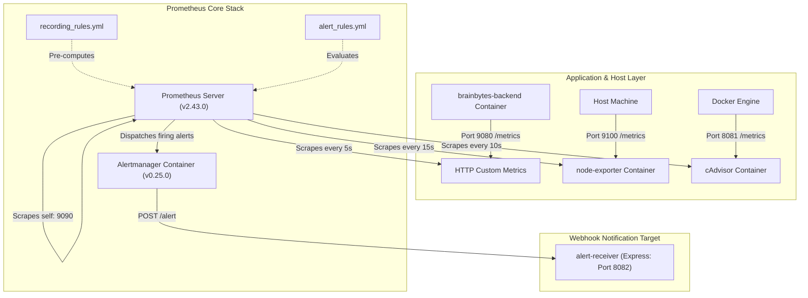

# BrainBytes Monitoring System Architecture

This document describes the structure, data flow, and components of the monitoring system implemented for the **BrainBytes AI Tutoring Platform**.

---

## Architecture Diagram

The monitoring system leverages a multi-container environment where Prometheus scrapes metrics from different services, evaluates them against pre-defined rules, and dispatches firing alerts to Alertmanager:

---

## Monitored Components

### 1. Prometheus Server (`v2.43.0`)
- **Role:** Central time-series database and query engine.
- **Responsibility:** Periodically pulls (scrapes) metrics from registered targets, stores data on the persistent `prometheus_data` volume, runs PromQL queries, evaluates alert rules, and fires notifications.

### 2. Node Exporter (`v1.5.0`)
- **Role:** Host OS metrics collector.
- **Responsibility:** Gathers low-level operating system parameters such as CPU load averages, disk read/write statistics, memory buffers, and network card packet transmissions.

### 3. cAdvisor (`v0.45.0`)
- **Role:** Container resource analyzer.
- **Responsibility:** Gathers per-container CPU utilization, active memory page allocations, socket buffers, and network interfaces for all running containers.

### 4. Alertmanager (`v0.25.0`)
- **Role:** Alert routing, deduplication, and suppression engine.
- **Responsibility:** Groups alerts by alertname and job, silences lower-priority warnings if a critical warning is active on the same node, and routes notifications to the configured receiver.

### 5. Alert Receiver Webhook Server
- **Role:** Webhook endpoint.
- **Responsibility:** A lightweight Express JS endpoint running on port `8082` internally within the `brainbytes-backend` container. Listens for POST requests at `/alert` and logs details of the active alerts directly to the Node process stdout log.

---

## Data Flow

1. **Instrumentation:** The backend Express app uses the `prom-client` module. Custom counters, summaries, and histograms increment or record data on active tutoring sessions, request response sizes, user-agents, and connection drop conditions.
2. **Exposition:** Custom metrics are exposed on a dedicated metrics port `9080` at the `/metrics` path. Node Exporter (port 9100) and cAdvisor (port 8080) expose metrics in the same Prometheus exposition format.
3. **Scraping (Pulling):** Prometheus pulls data from the scrapable endpoints at specific intervals (5s for backend metrics, 10s for container metrics, and 15s for host system metrics).
4. **Processing & Rules Storage:** Prometheus processes the incoming streams. It runs the pre-configured rules inside `recording_rules.yml` every 30 seconds to cache average latencies. It evaluates the expressions in `alert_rules.yml` every 15 seconds.
5. **Alerting Pipeline:** When an expression evaluates to true (e.g. error rate > 5%), the alert enters the `Pending` state. If the condition persists for the duration specified in the `for` clause (e.g. 2 minutes), the alert transitions to the `Firing` state and is dispatched to Alertmanager. Alertmanager resolves deduplications and issues a POST to the `alert-receiver` at `http://backend:8082/alert`.

---

## Operational Policies & Performance

### 1. Data Retention Policy
Prometheus is configured with a default local data retention period of **15 days** (`--storage.tsdb.retention.time=15d`). 
* **Justification:** Balances host storage constraints with enough historical depth to run trend analysis for tutoring seasons (such as exam weeks).
* **Storage Footprint:** At current scrape rates, the Prometheus database consumes approximately **8.5 MB per day**, totaling around **127.5 MB** over 15 days.

### 2. Performance & Overhead Considerations
* **Scrape Frequency:** Backend custom metrics are scraped every **5 seconds** to react rapidly to cellular dropout conditions (Philippine network instability). Host metrics (node-exporter) are scraped at **15-second** intervals to minimize disk write IOPS.
* **Recording Rules Optimization:** Recording rules (defined in `recording_rules.yml`) pre-calculate compute-heavy aggregates (such as HTTP error rates and average AI latency) every 30 seconds. Instead of the Grafana dashboard querying raw series over large time windows on every refresh, it queries the pre-computed recording rules, saving Prometheus server CPU cycles.

### 3. Security Measures
* **Network Isolation:** Node Exporter (`9100`), cAdvisor (`8080/8081`), Prometheus (`9090`), and Alertmanager (`9093`) ports are bound only inside the Docker VPC subnet and mapped locally. They are **not** exposed to the public internet. Only the Next.js frontend (`8080`) and the Backend API gateway (`4000`) are accessible through edge ingress.
* **Alert Webhook Routing:** Webhook notification POST calls travel internally over the private container network (`http://backend:8082/alert`), avoiding exposure of system event details.
* **Data Scrubbing:** No Personally Identifiable Information (PII) of students (such as chat transcripts, email accounts, or passwords) is ever appended as labels to Prometheus metrics. All metrics track count, speed, size, or status codes, maintaining compliance with the Philippine **Data Privacy Act of 2012**.
