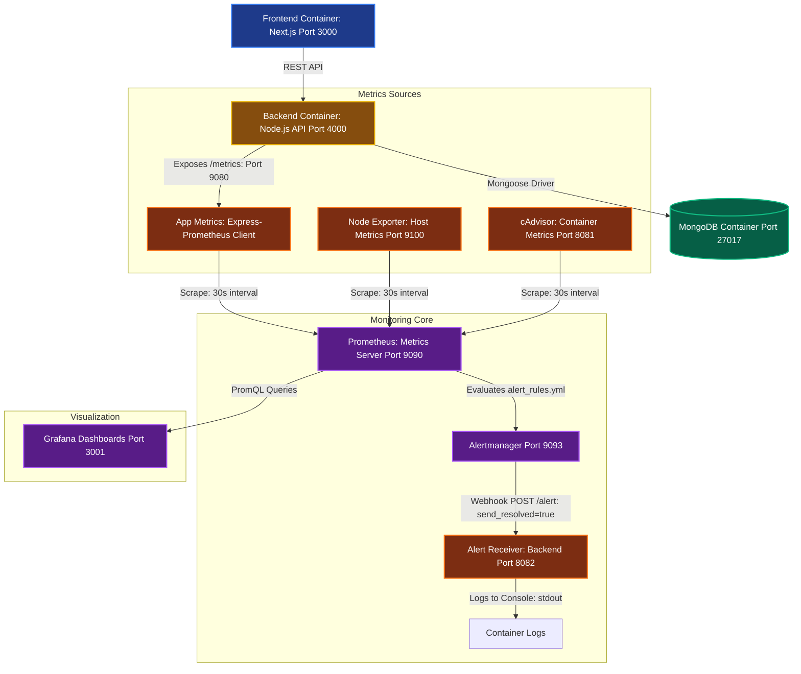

### 1.6 Monitoring Architecture Diagram
The diagram below illustrates how metrics are collected, aggregated, visualized, and alerted on across the BrainBytes stack.

```mermaid
graph TD
    %% App Services
    FE["Frontend Container: Next.js Port 3000"]
    BE["Backend Container: Node.js API Port 4000"]
    DB[("MongoDB Container Port 27017")]

    FE -->|REST API| BE
    BE -->|Mongoose Driver| DB

    subgraph Metrics_Sources ["Metrics Sources"]
        BE -->|Exposes /metrics: Port 9080| NodeApp["App Metrics: Express-Prometheus Client"]
        NodeExp["Node Exporter: Host Metrics Port 9100"]
        CAdvisor["cAdvisor: Container Metrics Port 8081"]
    end

    subgraph Monitoring_Core ["Monitoring Core"]
        Prom["Prometheus: Metrics Server Port 9090"]
        NodeApp -->|Scrape: 30s interval| Prom
        NodeExp -->|Scrape: 30s interval| Prom
        CAdvisor -->|Scrape: 30s interval| Prom

        Prom -->|Evaluates alert_rules.yml| AM["Alertmanager Port 9093"]
        AM -->|Webhook POST /alert: send_resolved=true| AR["Alert Receiver: Backend Port 8082"]
        AR -->|Logs to Console: stdout| Logs["Container Logs"]
    end

    subgraph Visualization ["Visualization"]
        Graf["Grafana Dashboards Port 3001"]
        Prom -->|PromQL Queries| Graf
    end

    %% Styling
    classDef frontend fill:#1e3a8a,stroke:#3b82f6,stroke-width:2px,color:#fff;
    classDef backend fill:#854d0e,stroke:#eab308,stroke-width:2px,color:#fff;
    classDef database fill:#065f46,stroke:#10b981,stroke-width:2px,color:#fff;
    classDef monitoring fill:#581c87,stroke:#a855f7,stroke-width:2px,color:#fff;
    classDef exporter fill:#7c2d12,stroke:#f97316,stroke-width:2px,color:#fff;

    class FE frontend;
    class BE backend;
    class DB database;
    class Prom,AM,Graf monitoring;
    class NodeApp,NodeExp,CAdvisor,AR exporter;
```
